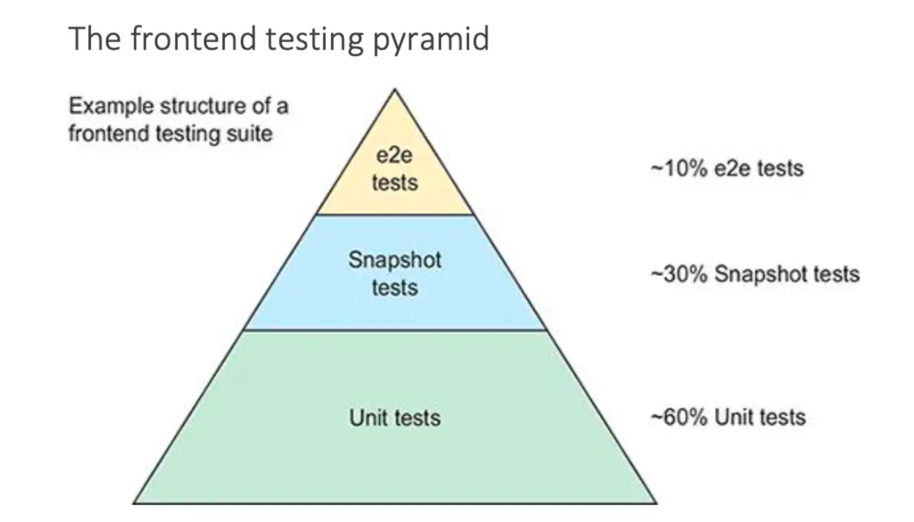

## 1、背景

当我们开启一个新项目的时候，相信都会对自己的每一个变量命名、参数设计、目录结构都经过了反复斟酌和多次修改，希望项目的设计哲学能够被后续的开发者理解并且参照着继续维护下去。然而随着项目需求数量的增加，迭代周期的拉长，开发人员的更替，最终代码风格和代码质量都会逐渐下降。于是研发同学开始设计出各类工具希望能够对代码的质量进行一定的限制，提前规避技术债务。

<!--truncate-->

在工程化快速发展的大前端时代，随着引入了 MVVM 这类框架使得前端的复杂性上升，测试越来越显得不可或缺了，同时也是保障代码质量和项目稳定性的重要支撑。当我们封装好了一个些公共组件或类库，都要求书写相关功能的测试用例，当测试用例达到一定的覆盖率且都通过的时候才能保证我们封装组件或库是有质量保证，同时也避免开发人员在界面进行手动测试。

## 2、什么是前端测试

上图摘自《Testing Vue.js Applications 1st Edition》

前端测试是在规定的条件下对程序进行操作，以发现程序错误，衡量软件质量，并对其是否能满足设计要求进行评估的过程。
当构建可靠的应用时，测试在个人或团队构建新特性、重构代码、修复 bug 等工作中扮演了关键的角色。尽管测试的流派有很多，但通俗来说前端测试主要有三大类：单元测试（Unit tests）、快照/组件测试（Snapshot tests）以及端到端测试（e2e tests）。

单元测试，又称模块测试，是针对前端模块中的最小可测试单元进行正确性检查和验证，对具体前端代码来说即针对函数、组件、类和模块这些独立单元的代码进行隔离测试。通过编写细致且有意义的测试，让你能够有信心在构建新特性或重构的代码的同时，保持应用的功能和稳定。

组件测试，在测试项目中的 React 组件的时候，许多测试用例都需要将它们挂载到 DOM（真实或虚拟）上，是否可以与之交互，以及表现是否符合预期，这样才能完全断言它们正在工作。同时生成测试的快照，当组件或者测试用例修改时，需要重新创建组件快照。

端到端（E2E）测试，检查跨越多个页面的及功能全链路的测试，虽然单元测试给开发者提供了一定的信心，但是单元测试和组件测试在部署到生产环境时提供应用整体的覆盖能力有限。端到端测试可以验证应用的所有层，这不仅仅包括前端代码，还包括所有相关的后端服务和基础设施，它们更能代表你的用户所处的环境。通过测试用户操作如何影响应用，端到端测试通常是验证应用是否正常运行的关键。

### 3、前端为什么需要测试？

1. JavaScript 的语言特性为弱类型语言，编译期间无法定位到错误，而单元测试可以帮你测试多种异常情况。从而提高代码质量，降低上线前的 BUG 风险；
1. 优秀的单元测试用例，也是最佳的代码使用文档，我们能够很清晰的读懂该模块的所有功能；
1. 当某个功能模块出现问题的时候，能够快速且准确的定位问题；
1. 可以更好的重构代码，在我们对前端模块进行重构的时候只需要把之前的用例全部测试通过即能够保证当前重构代码的可信度和稳定性；
1. 可以更好的协作和交接模块代码，在需要多人协作时，添加新功能的时候只需保证添加当前功能的测试用例和之前的所有测试都通过即能保证代码的可靠性；
1. 降低回归测试成本，系统性、全功能的前端自动测试能够解放一部分测试人员的精力，使用测试人员对重点功能着重测试；
1. 当项目代码的复杂度达到了一定的级别，前端测试也可以保证系统的稳定性和可维护性；
1. 测试可以验证代码和应用的正确性，在上线前做到心里有底，提升开发者信心和安全感，最大程度保证产品符合预期；
1. 有利于项目调试，如果通过 console 虽然可以打印出内部信息，但是这是一次性的事情，下次测试还需要从头来过，效率不能得到保证。通过编写测试用例，可以做到一次编写多次运行。

### 4、如何开始前端测试

### 4.1 建立测试规范

1. 类库单元测试：侧重于逻辑上的正确性，只关注应用程序整体功能的一小部分。他们可能会模拟你的应用程序环境的很大一部分（如初始状态、复杂的类、第三方模块和网络请求）；
1. 组件单元测试：一个组件可以通过两种方式测试，白盒：单元测试、黑盒：组件测试；区别是知不知晓一个组件的实现细节以及测试组件的颗粒度；
1. 组件测试：组件测试应该捕捉组件中的 prop、事件、提供的插槽、样式、CSS class 名、生命周期钩子，和其他相关的问题进行测试；
1. 端到端（E2E）测试：端到端测试通常会捕捉到路由、状态管理库、顶级组件（常见为 App 或 Layout）、公共资源或任何请求处理方面的问题。主要针对预上线环境的测试不仅包括你的前端代码和静态服务器，还包括所有相关的后端服务和基础设施。如上所述，它们可以捕捉到单元测试或组件测试无法捕捉的关键问题；
1. 统一测试框架技术选型，避免各项目间的测试技术壁垒；
1. 建立详细的测试规范，各项目统一使用一套测试规范；
1. 严格要是各项目的测试覆盖率必须打到某个值，保证前端代码质量；
1. 建立可靠的测试流程，提交代码合并和应用发布阶段执行所有测试用例；
1. 定期全员 review 项目测试用例。

### 4.2、单元测试框架选型

在单元测试中框架方面，每个框架都有自己的优缺点，没有最好的框架，只有最适合的框架。 React 的默认测试框架是 Jest，且被各种 React 应用推荐和使用。它基于 Jasmine，至今已经做了大量修改并添加了很多特性，同样也是开箱即用，支持断言，仿真，快照等。当前都是 React 项目所以单元测试推荐使用 Jest，我们基本不用做太多改造，就可以直接使用。

### 4.3、组件测试框架选型

在组件测试框架方面，因为当前项目使用的都是 React 技术生态，对于 React 组件测试有 Enzyme、testing-library 等，而 Enzyme 现阶段已经不推荐了，像 prfr-web 项目中使用 umijs 老版本还在使用，但是 umijs 后续版本升级已经替换为 testing-library 了，同时 React 官方和 create-react-app 都是使用 testing-library。

testing-library 它专注于测试组件而不依赖其他实现细节。因其良好的设计使得代码重构也变得非常容易。它的指导原则是，测试代码越接近软件的使用方式，它们就越值得信赖。所以组件测试我们推荐使用 testing-library。

### 4.4、端到端测试框架选型

在端到端（E2E）测试框架方面，选择测试框架时需要注意的事项提供一些指导：跨浏览器测试、更快的反馈（运行速度、热重载）、第一优先级的调试体验（是否支持浏览器开发工具）、无头模式下的可见性（快照、视频）

推荐使用 Cypress ，我们认为 Cypress 提供了最完整的端到端解决方案，其具有信息丰富的图形界面、出色的调试性、内置断言和存根、抗剥落性、并行化和快照等诸多特性。而且如上所述，它还提供对组件测试的支持。但是，它只支持测试基于 Chromium 的浏览器和 Firefox。如果某些方面有强制要求，且 Cypress 不符合，也可以选择 Playwright 或 Nightwatch v2。

## 5、何时测试

尽早开始测试！我们建议尽快开始编写测试。在开始为应用添加测试前，等的时间越长，应用就会有越多的依赖，想要开始添加测试就越困难。
