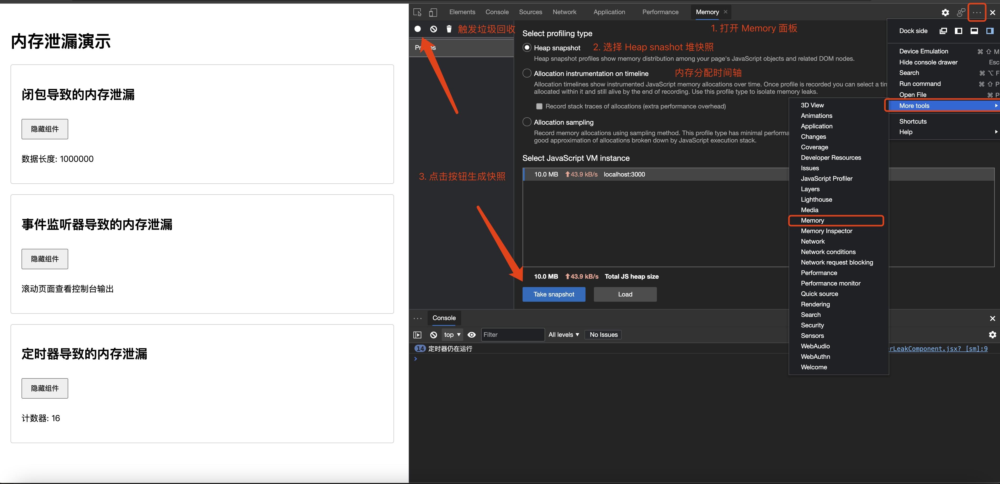
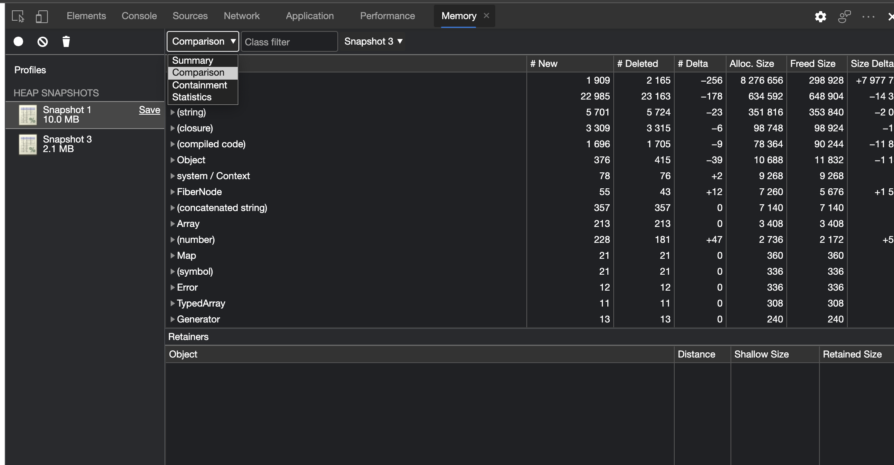
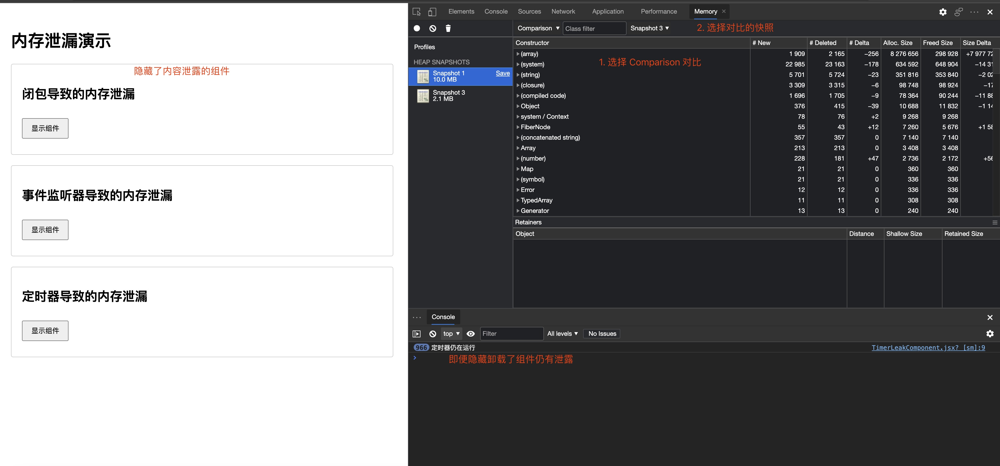
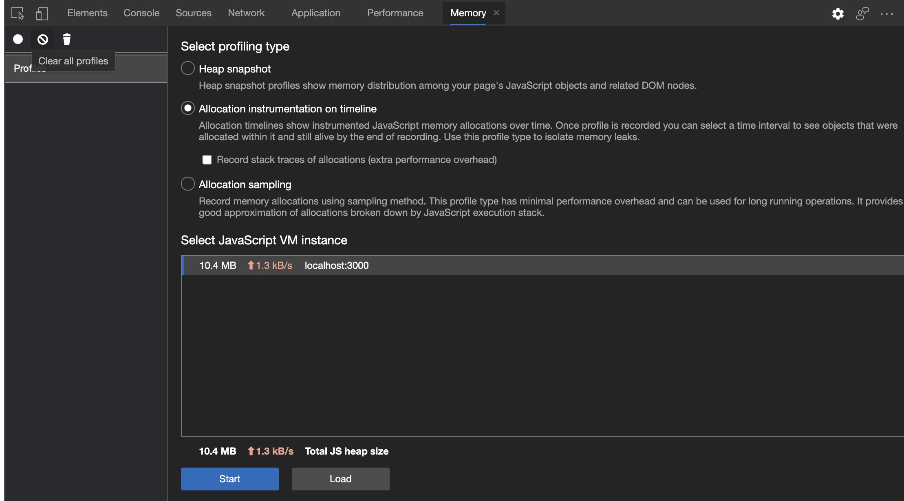
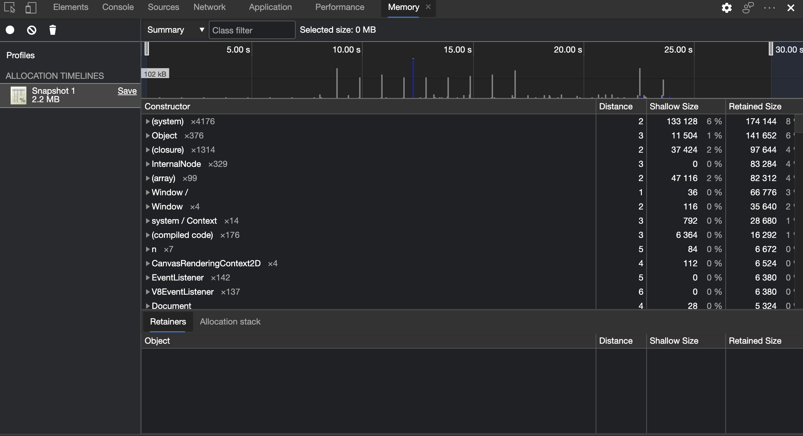
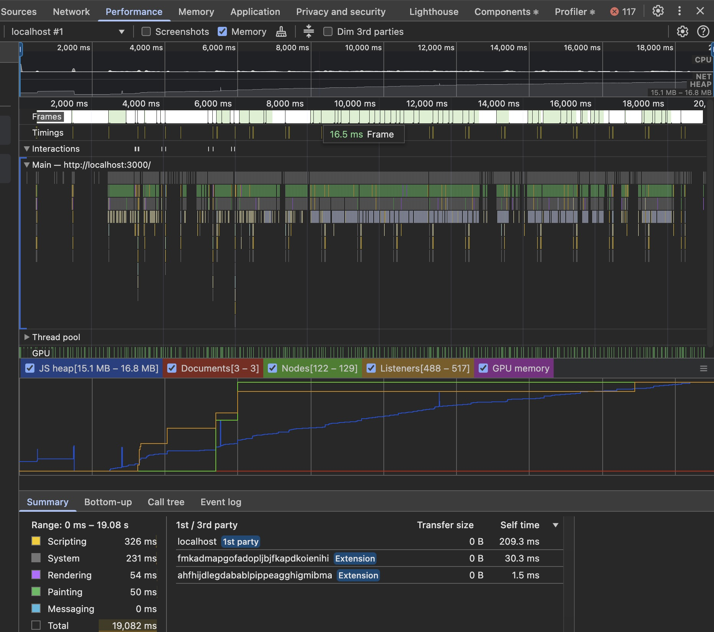

## 背景

当前项目的背景是一个同时支持 Web 和 Electron 的 ToB 的投研管理平台项目，最近用户反馈说网页使用一段时间后变得越来越卡顿，且用户有一个习惯就是一直打开应用不关闭。怀疑是不是出现了内存泄漏的问题？所以学习利用浏览器内核的 Chrome DevTools 的内存面板进行排查。

<!--truncate-->

## Chrome DevTools 排查步骤

### 写几个内存泄露的例子

#### 事件监听器导致的内存泄漏

```jsx
const EventListenerLeakComponent = () => {
  useEffect(() => {
    const handleScroll = () => {
      console.log('滚动事件触发');
    };

    // 添加事件监听器
    window.addEventListener('scroll', handleScroll);

    // 没有在清理函数中移除事件监听器
    // return () => {
    //   window.removeEventListener('scroll', handleScroll);
    // };
  }, []);

  return (
    <div>
      <p>滚动页面查看控制台输出</p>
    </div>
  );
};
```

#### 大数据导致的内存泄漏

```jsx
const MemoryLeakComponent = () => {
  const [data, setData] = useState([]);

  useEffect(() => {
    // 模拟大数据数组
    const leakyData = Array(1000000).fill('这是会导致内存泄漏的数据');
    setData(leakyData);

    // 这里没有清理函数，组件卸载时数据仍会保留在内存中
  }, []);

  return (
    <div>
      <p>数据长度: {data.length}</p>
    </div>
  );
};
```

#### 定时器导致的内存泄漏

```jsx
const TimerLeakComponent = () => {
  const [count, setCount] = useState(0);

  useEffect(() => {
    const timer = setInterval(() => {
      setCount((prev) => prev + 1);
      console.log('定时器仍在运行');
    }, 1000);

    // 没有清理定时器
    // return () => {
    //   clearInterval(timer);
    // };
  }, []);

  return (
    <div>
      <p>计数器: {count}</p>
    </div>
  );
};
```

### 1. 使用 Memory 面板进行堆快照（Heap Snapshot）分析

获取快照操作步骤：

1. 打开 DevTools > Memory (没有 Memory 面板的可以在右侧的`...`中选择 More tools 然后选择 Memory)
1. 选择 "Heap Snapshot" 选项
1. 点击 "Take snapshot" 获取初始状态的快照
1. 在应用中进行可能导致内存泄漏的操作（比如多次切换组件显示/隐藏）
1. 再次获取快照



快照分析视图：

- Summary 视图：按构造函数对象分
- Comparison 视图：比较快照差
- Containment 视图：查看对象引用关
- Statistics 视图：统计内存使用情况



在"Comparison" 比较视图中比较两次快照（关注 "Delta" 列）：

- 分析闭包数据比较视图中：
  - 查找 Array 对象
  - 检查 Detached HTMLDivElement
  - 观察 Closure 对象
- 分析监听事件比较视图中：
  - 搜索 "eventListener"
  - 检查 WindowEventHandlers



### 2. 使用 Memory 面板进行内存分配时间线（Allocation on Timeline）分析

获取快照操作步骤：

1. 打开 DevTools > Memory
1. 选择 "Allocation instrumentation on timeline" 选项
1. 点击 "Start" 开始记录
1. 在应用中进行可能导致内存泄漏的操作（比如多次切换组件显示/隐藏）
1. 停止记录



观察内存时间分配视图：

- 蓝条：表示新分配的内存
- 灰条：表示被释放的内存
- 条形高度：表示分配内存的大小
- 时间轴：显示内存分配的具体时间点



### 3. Performance 面板内存监控

监控步骤：

1. 打开 DevTools > Performance
1. 勾选 Memory
1. 点击 Record 开始记录
1. 执行可疑操作（显示/隐藏组件）
1. 观察 JS Heap 等大小
1. 停止记录并分析内存曲线
1. 关注内存持续上升

关键指标：

- JS Heap：JavaScript 堆内存使用情况
- Documents：文档对象数量
- Nodes：DOM 节点数量
- Listeners：事件监听器数量



## 常见内存泄漏案例解析

### 1. 事件监听器泄漏

问题：组件销毁时未移除事件监听器

解决：

- 使用 removeEventListener 清理监听器
- 在组件销毁钩子中进行清理
- 使用事件委托减少监听器数量

### 2. 定时器泄漏

问题：定时器未及时清除

解决：

- 保存定时器 ID
- 组件销毁时清除定时器
- 使用 requestAnimationFrame 替代部分定时器

### 3. 闭包导致的泄漏

问题：闭包中引用大对象

解决：

- 及时解除对大对象的引用
- 使用弱引用存储对象
- 避免在闭包中持有 DOM 引用

### 4. 全局变量泄漏

问题：全局变量未及时清理

解决：

- 使用模块化管理全局变量
- 在页面卸载时清理全局变量

## 实用建议

1. 建立内存检测机制，定期进行内存快照对比
2. 开发组件时注意清理工作，特别是事件监听和定时器
3. 使用弱引用（WeakMap/WeakSet）存储 DOM 引用
4. 避免闭包中引用大对象
5. 及时释放不再使用的变量

## 总结

内存泄漏问题往往在开发阶段难以发现，需要在实际运行环境中长期观察。掌握 Chrome DevTools 的使用方法，建立良好的开发习惯，才能从根本上预防内存泄漏问题。
