<!--truncate-->

## 袋鼠云 EasyV 可视化大屏产品

[EasyV](https://dtstack.yuque.com/books/share/857405df-2200-4fc9-b9c3-7d8579fa38be/blzu4v) 是一款在线数字孪生可视化应用开发平台，使用者无需设计经验或技术背景，通过简单的组件拖拽、画布编辑等操作方式即可快速创建出美观酷炫的数据可视化应用。平台支持多种数据源类型接入，具备数据实时更新性强、视觉效果丰富等特点。 [视频介绍](https://easyv.assets.dtstack.com/homepage-assets/videos/easyv_home_video.mp4)

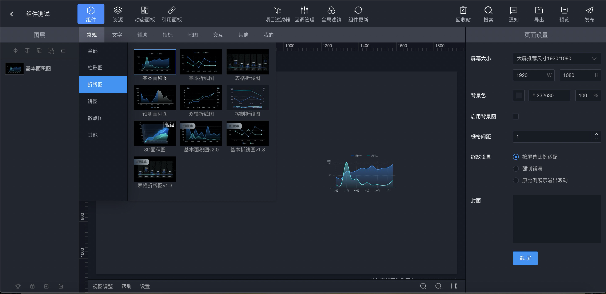

### 特性

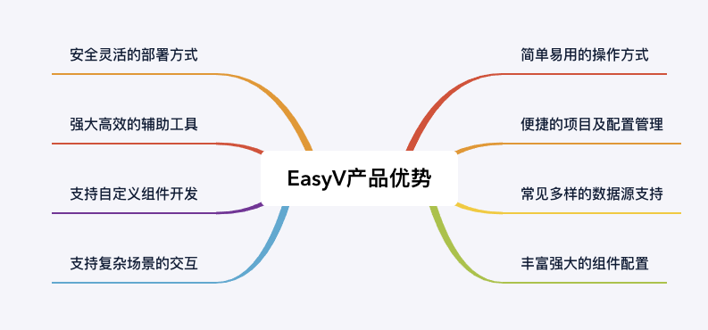

#### 可视化编辑器

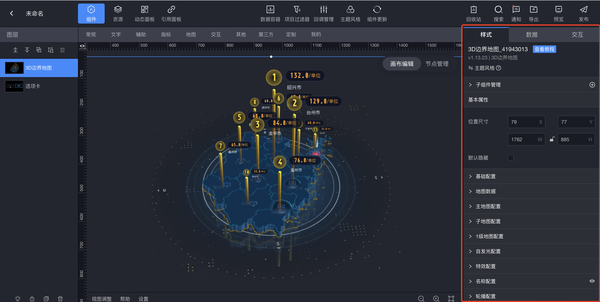

#### 海量素材内容

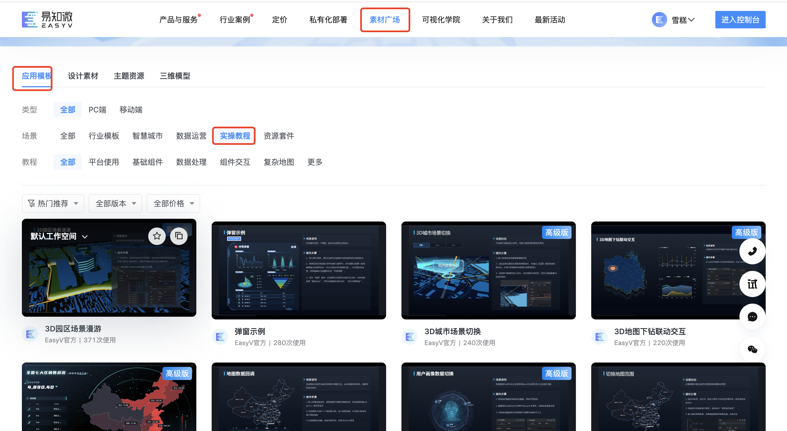

素材广场提供海量模板、素材、模型等设计资产，快速完成业务场景还原与想法实现。

#### 主流数据源实时接入

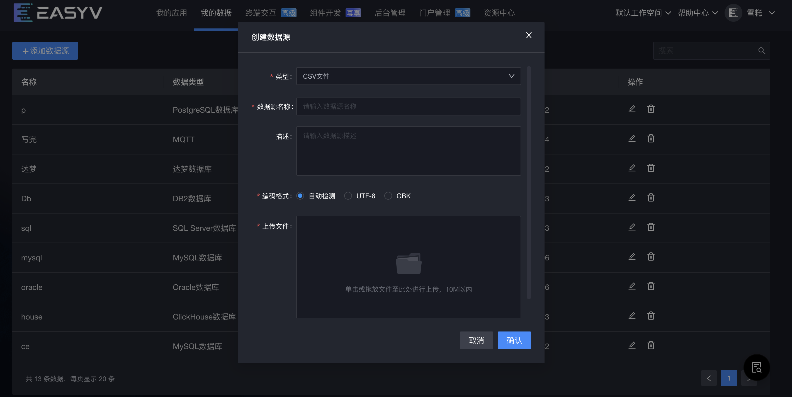

EasyV 支持多种数据源接入，包括 MySQL、Oracle、SQL Server 等常见关系型数据库，CSV、JSON 静态数据、HTTP API 等，其他数据源可根据用户实际场景快速集成。用户可以对数据源进行管理，在数据源列表中增删、编辑数据源。

#### 开放可视化生态

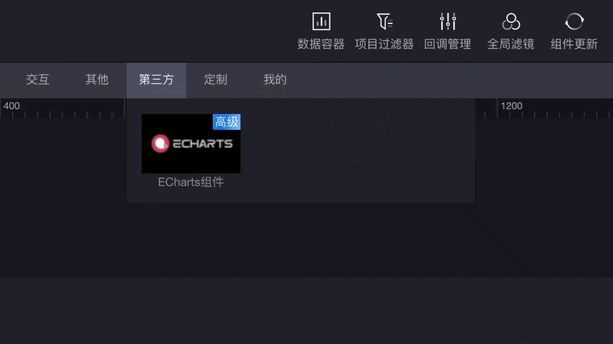

集成外部开源平台如第三方 ECharts 组件、游戏引擎、GIS、BIM 等，融合打造数字孪生场景，支持多类型环境部署与用户自定义组件。

### 应用场景

1. 数字化管理
2. 指挥中心
3. 数字化展厅

### 产品架构

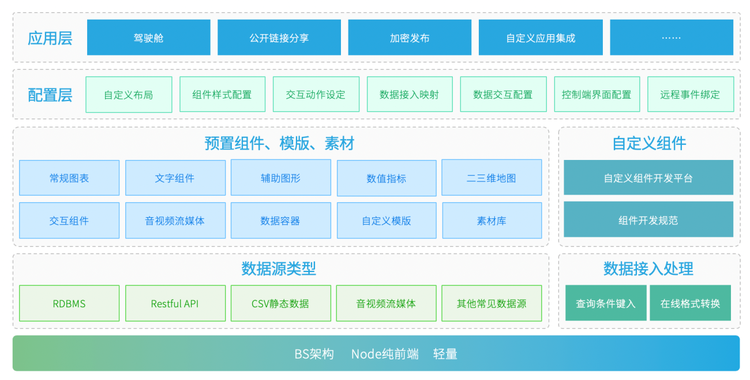

### EasyV 实现思路

EasyV 低代码可视化平台实现原理：

1. 先预置丰富的原子组件，通过拖拽选择所需组件在画板上进行位置的编排。
2. 之后，进行一些组件属性的设置。
3. 设置完之后，需要确定搭建协议：一种界面到代码再有代码到界面的表示方式（ 即：DSL 领域特定语言），如：JSON Schema，从而驱动用户端的内容渲染。
4. 打通 DevOps 发布和部署

实现的要点：

#### 1、设计和开发原子组件

##### a)组件分类

EasyV 组件分为常规、文字、辅助、指标、交互、其他、第三方几类组件。

1. 常规：常规组件包含柱形图、折线图、饼图、散点图、漏斗图、K 线图、树形展示图等组件，通常用于展示数据间的趋势对比，比如不同分类间的数值对比，不同时间点的数据对比。
2. 文字：文字组件中包含多种形式用来展示基础文字类型数据的组件，主要用来作为标题、页面提示等形式出现。
3. 辅助：辅助组件包含图片、视频、声音、iframe 等作为辅助组件来装饰项目。
4. 指标：指标组件包含基本水位图、仪表盘、分类占比图、栅格进度图、热力图等多种动态展示数据指标或者数据报警等情况组件。
5. 地图：地图组件包含 3D 地球、多种 2D 地图、高德地图、3D 城市、3D 园区等组件，地图组件以子组件的形式展示地图中的散点、路径、标牌等信息，其中 3D 园区和 3D 城市组件可以导入 glb 格式模型，并可对模型配置交互，搭建智慧园区等场景。
6. 交互：交互组件包含多种选项卡、弹框、下拉菜单、交互组件、全屏切换等多种与其他组件配合进行事件交互的基础组件。
7. 其他：其他组件包含天气、时间组件、倒计时组件、金额组件、表格组件、轮播组件、数据容器组件，通常数据容器主要用作数据集合和分发。
8. 第三方：第三方组件中集成 ECharts，可通过 ECharts 代码，快速集成 ECharts 中的可视化组件。

##### b)组件管理

1. 内置大量的原子组件，并分类管理；
2. 制定组件开发范式；
3. 提供用户自定义组件方式。

#### 2、布局系统

栅格布局、不同分辨率布局、页面布局、组件布局。

#### 3、组件/页面配置

提供可配置的组件和页面的属性。

#### 4、项目管理

管理多个发布与未发布的项目。

#### 5、模版管理

管理和提供多个常用的项目模版，可以直接使用模版进行编辑。

#### 6、历史记录

提供记录历史操作的动作，可以通过撤销进行操作回滚。

#### 7、图层控制

提供图层控制功能，控制两个组件间的上下层覆盖顺序。

#### 8、状态联动

提供两个组件件的联动功能。

#### 9、事件编排

提供事件编排功能，比如提供数据源返回后的处理事件、用户操作的响应事件等。

#### 10、数据绑定

提功多种动态、静态数据源绑定功能。

#### 11、页面渲染

把在编辑器设计出的页面，通过通用的协议渲染出最终的展示页面。

#### 12、发布部署

打通平台和 DevOps 流程，提供直接发布部署功能。

#### 13、状态更新

基于 WebSocket 通信机制，建立长链接，实现了心跳及重连机制，实时对上线发布后的大屏进行更新或下线管理。

## GoView 开源低代码数据可视化开发平台

[GoView](http://1.117.240.165:8080/goview/#/login) 是一个开源低代码数据可视化开发平台（[MIT 开源协议](http://www.mtruning.club:81/framework/disclaimer/disclaimer.html) ），基本功能与 EasyV 类似，它的技术栈为：
|名称|版本 |名称 |版本|
|--|--|--|--|
|Vue |3.2.x |TypeScript|4 4.6.x|
|Vite |2.9.x |NaiveUI |2.27.x|
|ECharts |5.3.x| Pinia |2.0.x|

### 技术点：

1. 框架：基于 Vue3 框架编写，使用 Hooks 写法抽离部分逻辑，使代码结构更加清晰；
2. 类型：使用 TypeScript 进行类型约束，减少未知错误发生概率，可以大胆修改逻辑内容；
3. 性能：多处性能优化，使用页面懒加载、组件动态注册、数据滚动加载等方式，提升页面渲染速度；
4. 存储：拥有本地记忆，部分配置项采用 Storage 存储本地，提升使用体验；
5. 封装：项目进行了详细的工具类封装，如：路由、存储、加/解密、文件处理、主题、NaiveUI 全局方法、组件等。

GoView 是基于 MIT 协议的个人开源作品，相对于 EasyV 和 DataV 成熟度和稳定性有些差距，如果需要搭建低代码可视化开发平台可以参考该项目代码或者直接在其基础上进行二次开发。

#### 页面示例：

1. 系统首页

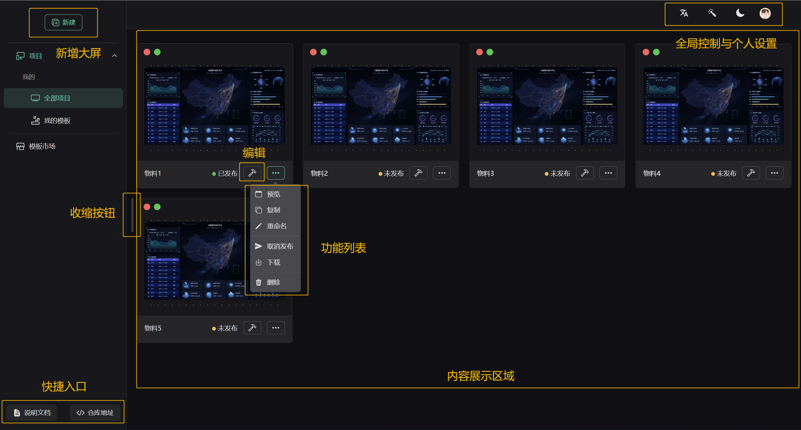

2. 工作空间（编辑区域）

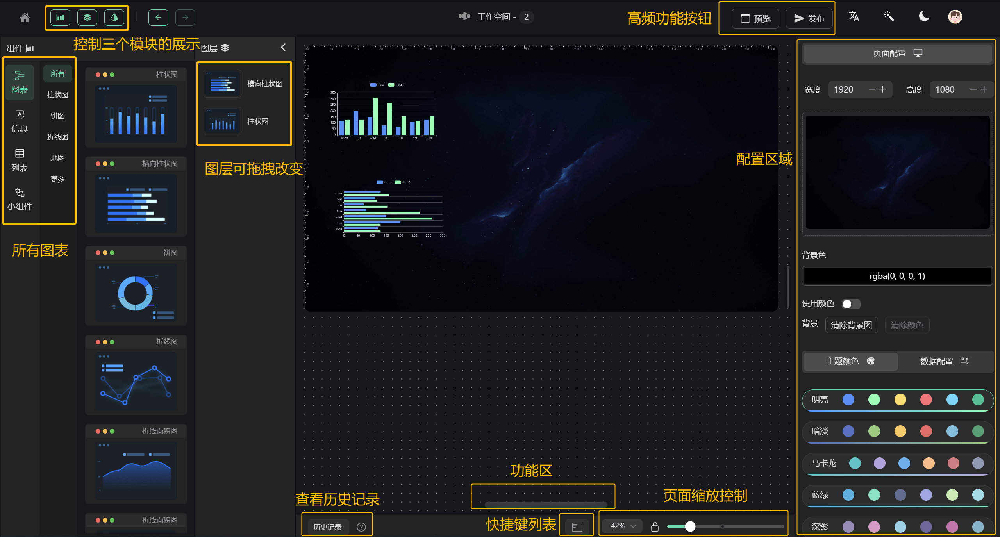

3. 请求设置

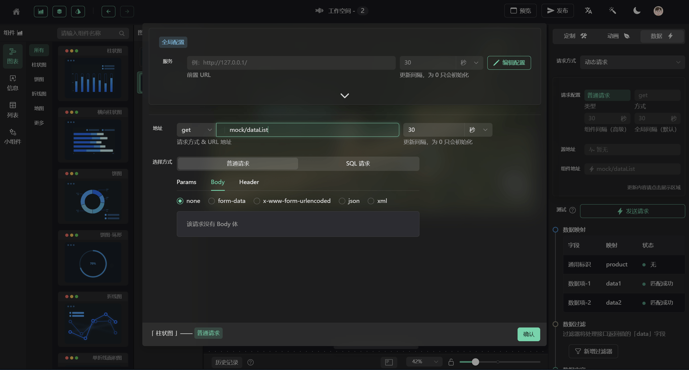

4. 数据过滤

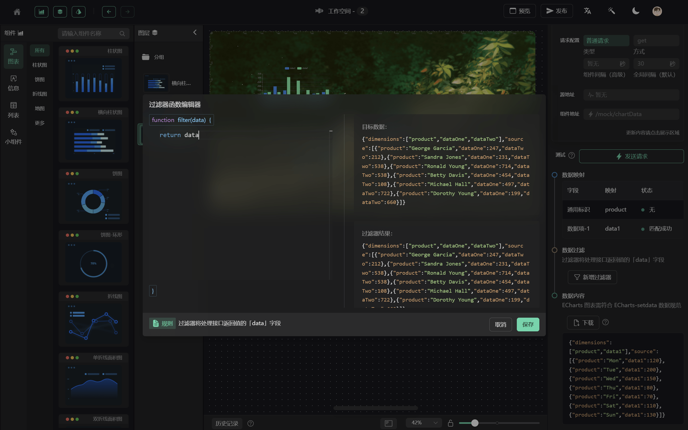

### 应用架构：

1. 工作空间

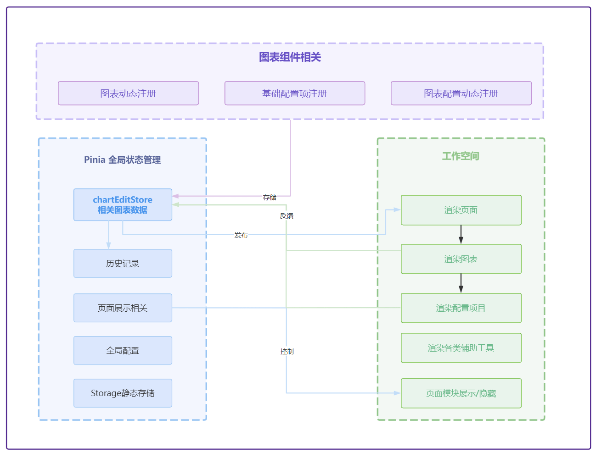

2. 单个图表组件的应用架构

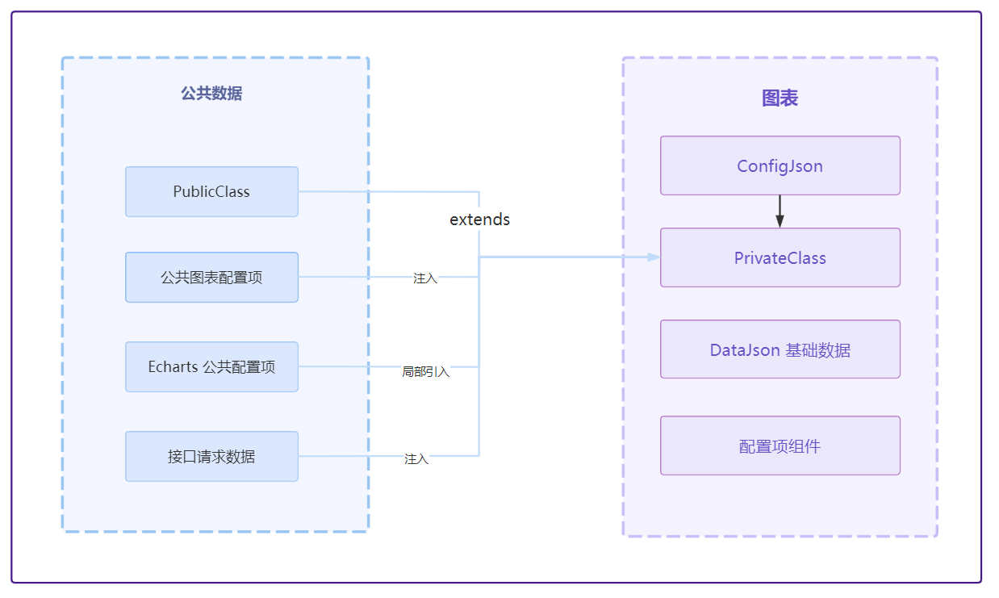

3. 预览功能架构

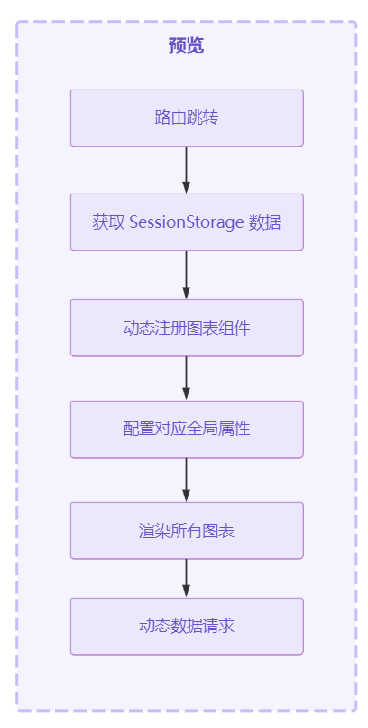

4. 历史记录功能逻辑结构

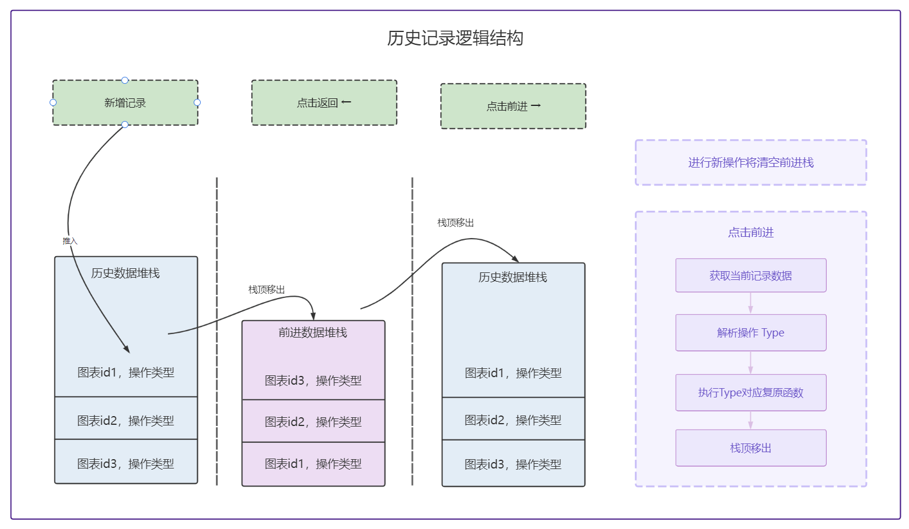

## 其他类似产品对比

### 1.阿里云 [DataV](https://www.aliyun.com/product/bigdata/datav) 数据可视化应用搭建工具

阿里云 DataV 实现技术栈为原生 **JavaScript + JQuery** 的基本组合，依托阿里云平台，整合了平台中的其他服务，**亮点是 AI 设计辅助能力**，基于智能主题配色、一键美化、大屏智能生成等智能化工具，可以快速解决在搭建可视化应用时遇到的整体样式配置困难问题。

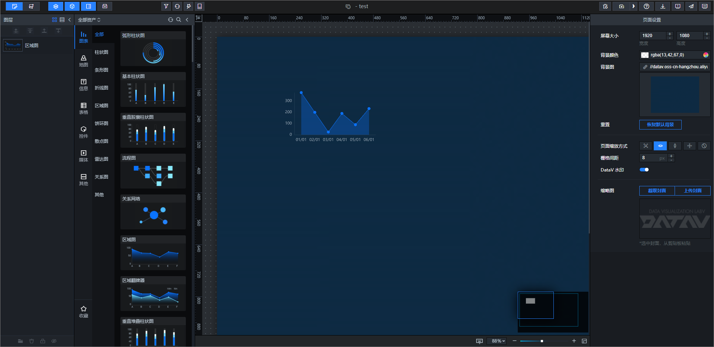

### 2.[DataV](https://github.com/DataV-Team) 开源数据可视化组件库，无拖拽编辑器

开源社区模仿阿里云的 DataV 产品做出来的可视化组件库，**主要面向大屏开发人员**，组件库提供了 React 和 Vue 两个版本，其中 Vue 版本主要是基于 Vue2 的版本，Vue3 的版本还在开发阶段。DataV 仅仅提供了可视化组件，如果要开发低代码可视化平台的话可以基于其组件库功能，然后自行实现其他功能。

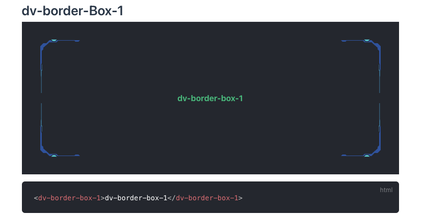

### 3.阿里的低代码引擎 [LowCodeEngine](https://lowcode-engine.cn/)

该引擎定义了协议，如果需要自建平台，可以基于引擎可以开发引擎生态，生态再支撑低代码研发平台搭建，最后产出的是代码。无法自由拖动进行布局编排，不够灵活。它比较适用于简单的、规范的 B 端场景。

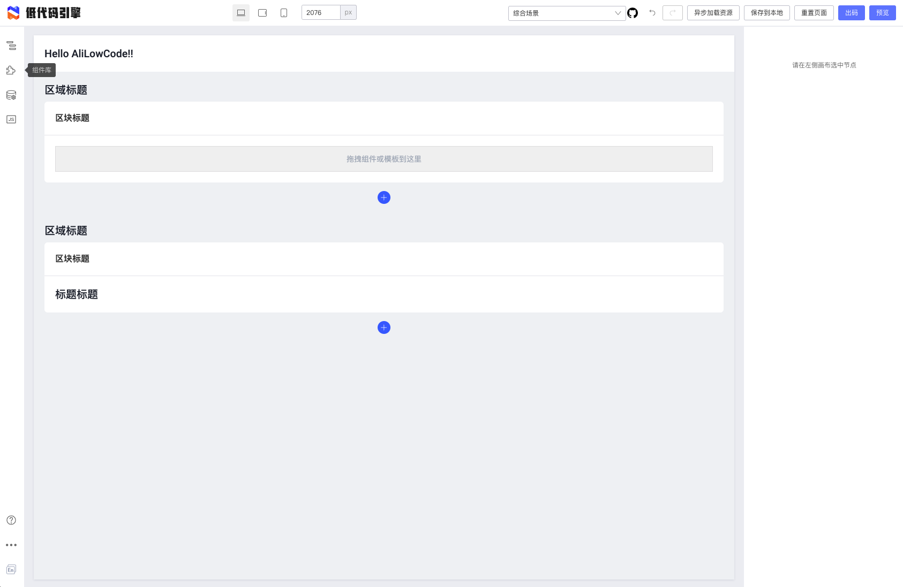
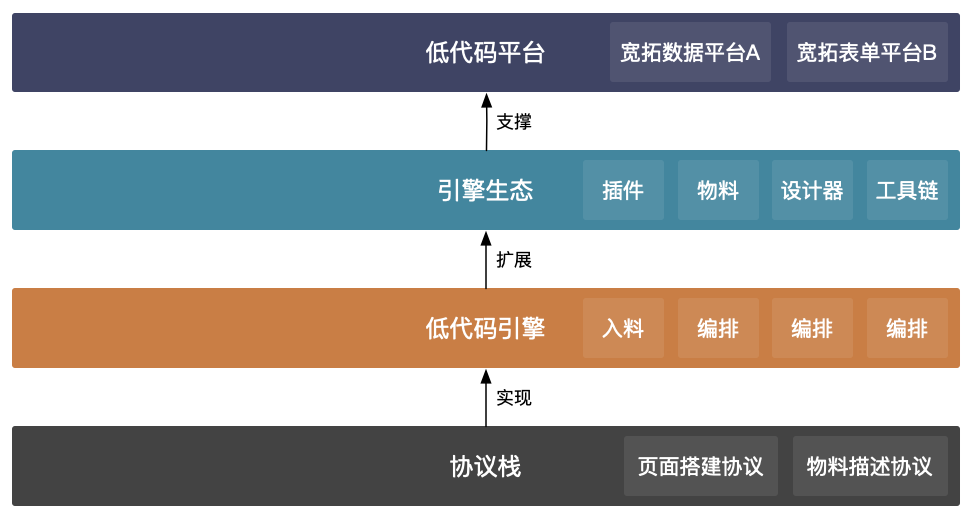

### 4.总结

| 对比项         | 袋鼠云             | EasyV              | 阿里云             | DataV            | GoView         | 开源 DataV | 阿里低代码引擎 |
| -------------- | ------------------ | ------------------ | ------------------ | ---------------- | -------------- | ---------- | -------------- |
| 产品属性       | 收费大屏可视化平台 | 收费大屏可视化平台 | 开源大屏可视化平台 | 开源可视化组件库 | 开源低代码引擎 |
| 技术栈         | React              | JavaScript、JQuery | Vue3               | Vue+React        | React          |
| 是否为完整平台 | 是                 | 是                 | 是                 | 否               | 否             |
| 应用场景       | 大屏               | 大屏               | 大屏               | 大屏             | 管理端         |
| 浏览兼容性     | 较好               | 好                 | 一般               | 较好             | 较好           |

### 5.布局插件：[React-Grid-Layout](https://github.com/react-grid-layout/react-grid-layout)

基于 **React 的网格布局系统组件**，它支持响应式和断点布局，断点布局可以有用户提供或自动生成。可以参考实现拖拽器。

- 特性：可拖动部件位置、可调整部件大小、静态小部件、响应式断点等。
- 不足：不支持自由布局、组件不同纬度拖拽、锁定宽高比、旋转透明度等。

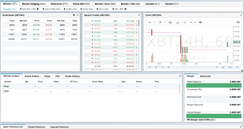

## 代码开发和低代码对比

| 对比项             | 代码开发     | 低代码可视化产品平台           |
| ------------------ | ------------ | ------------------------------ |
| 目标人员           | 应用开发人员 | 应用开发人员、设计师、业务人员 |
| 使用场景           | 全行业应用   | 全行业应用                     |
| 数据接入能力       | 强           | 中                             |
| 数据准备和建模能力 | 强           | 弱                             |
| 多维数据分析能力   | 强           | 弱                             |
| 可视化页面搭建能力 | 弱           | 强                             |
| 低代码交互开发能力 | 弱           | 强                             |
| 应用灵活性         | 强           | 弱                             |
| 复杂项目支持       | 强           | 弱                             |
| 应用搭建效率       | 低           | 高                             |
| 平台搭建成本       | 低           | 高                             |
| 系统集成能力       | 强           | 中                             |
| 安全能力           | 强           | 中                             |

## 其他资料

1. [袋鼠云 EasyV 低代码可视化平台](https://easyv.cloud/)
1. [2021 年中国低代码行业短报告](https://pdf.dfcfw.com/pdf/H3_AP202103291477916180_1.pdf)
1. [GoView 开源低代码数据可视化开发平台](http://1.117.240.165:8080/goview/#/login)
1. [阿里云 DataV 数据可视化](https://www.aliyun.com/product/bigdata/datav)
1. [阿里的低代码引擎](https://lowcode-engine.cn/)
1. [DataV 开源数据可视化组件库](https://github.com/DataV-Team)
1. [数据可视化图表组件原型图](https://www.axureux.com/demo/Templates022/%E5%B8%B8%E7%94%A8%E5%9B%BE%E8%A1%A8.html)
1. [布局插件](https://github.com/react-grid-layout/react-grid-layout)
