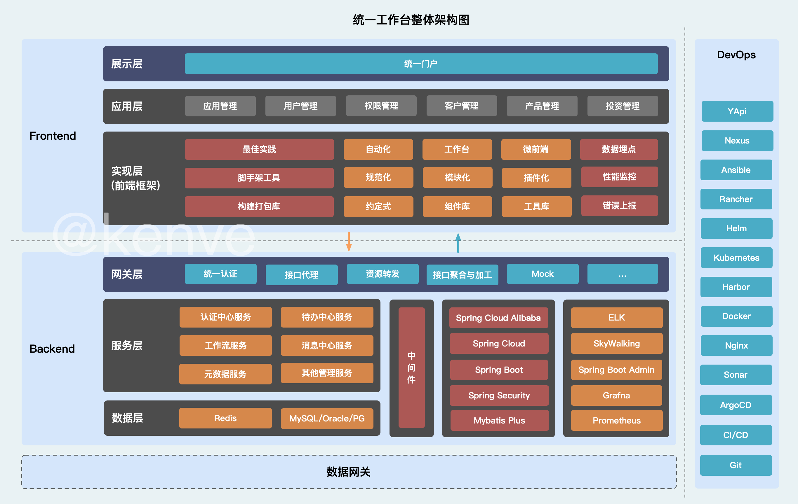
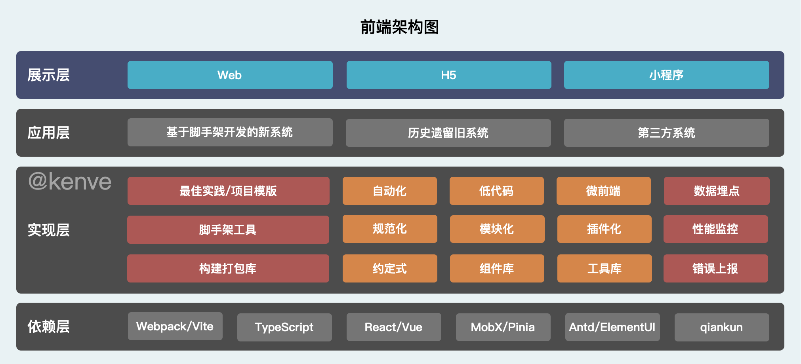
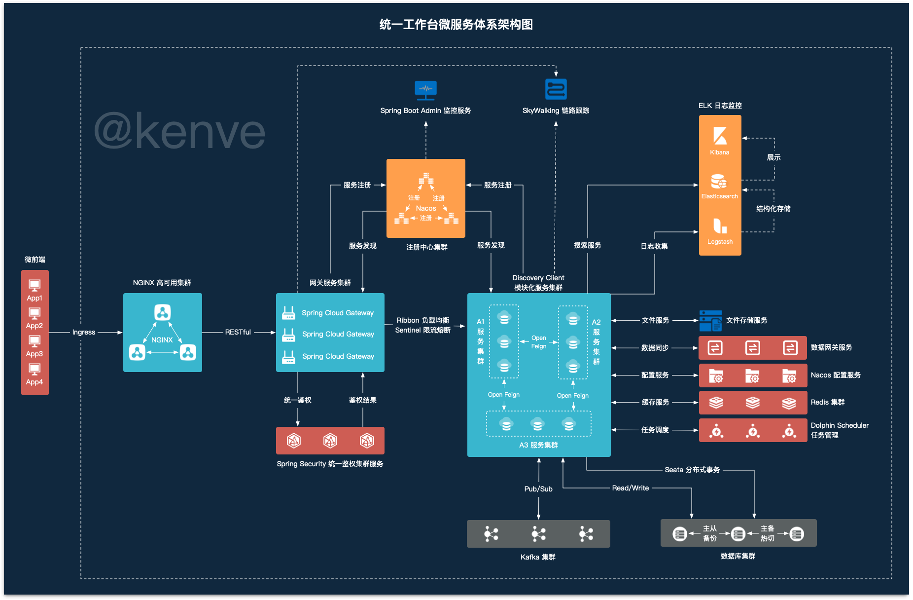

## 1. 背景

目前，很多公司内部“个体独立多系统+风格各异式+重复开发”的传统开发模式，存在效率低、页面固化、重复开发、各系统“技术+风格”不一致等缺点，难以形成统一用户体验且开发响应周期长，用户体验较差。

<!--truncate-->

未来系统建设要摆脱传统烟囱式构建形式，着重技术中台+数据平台+敏捷轻应用一体化构建，坚持“一个蓝图绘到底、模块组件化、分期分段实施”的原则，统一技术架构、加强信息共享、标准系统交互接口，同时抽象沉淀公共基础技术组件及数据，以潜在业务需求和数据需求为导向，实现前中后一体化的业务运作平台。

## 2.现状分析

随着信息化发展，业务系统日益繁多，多系统存在不少的困扰与不便。

1. 多个系统多次登录，登录页面与方式各不相同，操作方式差异大等问题；
2. 业务人员需登录不同的系统获取不同的消息，存在不能及时获取或者遗漏消息的情况；
3. 业务人员办理跨系统流程的时候，需要登录不同的系统进行处理；
4. 业务人员获取业务信息需要登录不同的系统去获取，并且有些信息的获取路径比较深入，操作麻烦，在系统切换上浪费不必要的时间；
5. 业务人员在不同系统的每日待办事项，需要分别登录系统去查阅并处理，或者人工记录；
6. 业务人员缺乏一个一览所有相关系统，其所关注业务信息的首页，不能快速知道业务最新情况与工作整体进度等；
7. 现有系统技术架构不同，随着新建系统不同技术增加，维护成本剧增。

## 3.总体设计

### 3.1.需求范围

项目的核心诉求是一体化的业务运作平台。但由于当前系统建设分散导致业务流程割裂，用户跨系统操作频繁，系统消息分散缺少统一汇总，子应用间页面风格、交互设计差异较大，对业务处理效率有一定影响，且存在消息丢失导致的业务操作不及时，业务状态跟踪较难的情况，一定程度影响了工作效率。

在技术架构层面，由于多个系统存在架构差异，系统开发运维成本较高，一定程度影响了业务需求的响应速度。并在技术方面要求微服务架构模式，具有高开放型的技术架构和低代码化的架构能力，便于后续的灵活整合子应用和功能拓展，提供具有高拓展性的架构底座。

在此背景之下，项目需求范围主要包括：

- 统一登陆认证：基于 OAuth2、OIDC 等实现 SSO 单点登录，用户只需要在工作台一次登录，操作其他系统不再需要登录，实现用户在不同系统之间无感知切换，降低用户登录不同系统的时间成本。
- 用户权限管理：平台进行资源权限的授权，需细粒度到具体子应用，菜单以及按钮，包括访问权限、接口操作权限、数据权限等。
- 统一工作台：依托微前端和微服务，统一管理管理不同子系统业务，可以提供用户自定义工作区间编排功能。
- 统一 UI 风格：不同系统应统一基本的主题颜色。新系统直接通过开发的脚手架开发项目直接使用默认的主题配置即可。
- 统一工作流：工作台提供流程统一的功能（BPMN2.0），对于接入工作台的子系统，提供了流程汇总功能，直接在工作台就能看到所有子系统的流程。
- 统一消息管理：工作台提供消息统一的功能（MQ），对于接入工作台的子系统，提供了消息汇总的功能。
- 安全审计：结合权限管理和系统网关服务，可以对用户的操作行为进行记录和对敏感或为授权的行为进行预警和阻拦。
- 流量管理：根据微服务架构图，我们可以在工作台的系统网关服务后，使用 Ribbon 做负载均衡、使用 Sentinel 做限流熔断的功能。
- 链路追踪：引入 Skywalking 实现对服务链路状态进行跟踪，结合前端的和服务端监控针对用户的操作进行记录，并且可以在 ELK 查询。
- 服务状态管理：工作台添加服务状态管理功能，支持对服务的上下架，通过工作台可以对访问的服务管控。
- 访问审计：添加安全审计管理功能，在工作台系统网关服务，可以对用户的访问频率、来源等进行记录，并设计规则和条件对可以行为触发黑白名单、熔断限制等功能。
- 动态脱敏：添加数据网关对返回给访问者进行敏感数据动态脱敏功能。
- 数据组件/用户行为监控：前端提供用户行为监控 SDK，对用行为及应用访问情况进行收集，然后通过 HTTP 进行日志上报后端服务，后端服务将相关日志清洗落库，最后通过前端数据组件进行展示；
- 其他管理功能和集成功能等。

### 3.3.整体架构

工作台整体架构依托创新理念，以微服务技术架构为基础底座，继承了技术架构方面高性能、高并发、高可用的技术特点。

整合了微服务、微前端、响应式等架构设计的最佳实践以及深度打磨的技术实现。可以利用这些特点来对微服务、微前端架构设计中的一些关键点进行优化，包括服务拆分、服务治理、API 接口规划、数据库拆分、团队规划、持续集成策略等等核心架构设计行为。同时，可以为公司内部输出更加完善的架构规范和技术栈管理。

### 3.4.前端架构

为解决巨大单体应用带来的严峻挑战，工作台前端框架需要集成微前端、工作台组装等前沿技术，并需针对资管类业务封装通用的业务组件，从而帮助前端工程师快速构建项目，加速项目迭代。除此之外，前端开发人员可以利用前端框架高效实现旧系统整合、异构技术整合，打造统一用户体验。

## 3.5.微服务架构

微服务架构时代，服务端开发工程师持续受到巨大的挑战，作为核心金融领域的资管业务系统的核心服务开发挑战更多。利用这些微服务体系基础架构，服务端工程师可以高效地开发出健壮的、高性能的、微服务化的服务，或者改造升级原有的存量系统，以此为基础打造响应业务需求的敏捷能力。

## 3.6.统一应用技术要点

为了未来信息建设长足、高效、有序发展，需制定统一的应用技术标准。既能满足现有系统的融合，又能为后续新建系统进行有效的技术指引。

### 3.6.1.前端

- 工具库：提供前端开发的统一工具库，针对常用的 HTTP 请求库、WebSocket 推送库等进行封装。
- 组件库：提供前端开发基础组件库及业务组件库，在开发系统时提升开发效率和统一 UI 及交互规范，打造更加统一、更好的用户体验。
- 打包库：提供前端统一打包库，简化开发人员的配置工作，专注于实现业务功能，同时结合微前端基座应用和子应用的区分不同的打包配置。
- 脚手架：提供前端开发脚手架，定义统一的工程规范、目录规范、打包规范、代码规范、测试规范等，针对前端基座一应用和子应用定义多个不同的前端工程模版。
- 微前端：采用微前端框架集成不同的应用系统。首先引入外框架与子应用的概念，外框架负责系统整体布局以及子应用的注册、加载与渲染，比如：Qiankun+Module Federation。

### 3.6.2.后端中间件

- 消息中间件：根据资管业务特性，采用市场主流的消息中间件进行开发改造，满足工作台业务需求，提供工作台消息的汇总，收发与订阅等功能，比如：Kafka。
- 工作流中间件：采用 BPMN2.0 可视化流程设计，各个子应用的工作流尽可能的逐步接入工作台的统一工作流之中。工作台中的流程通过统一工作流进行流转与处理，比如：Camunda+Flowable 进行开发改造。
- 定时调度：满足部分分布式应用的定时任务需求。比如使用 Dolphin Scheduler。
- 存储：热数据、临时数据等通过缓存 Redis 进行管理实现；数据库通过数据网关获取；全文搜索通过 ElasticSearch 实现。
- 数据同步：数据网关服务基于 Flink、Spark、SeaTunnel 等可以实现实时和离线的数据同步功能。
- 链路跟踪：通过 SkyWalking 进行全部服务的链路跟踪，并且与中心的链路跟踪相统一。
- 日志采集：通过 ELK 进行日志相关的采集，并且与中心的日志采集相统一。
