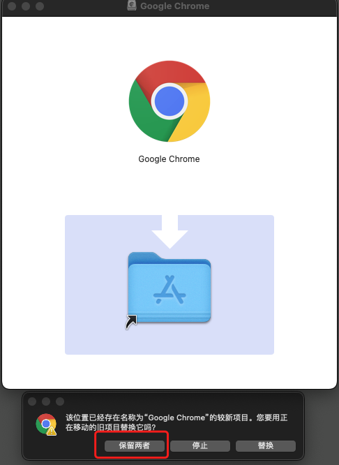
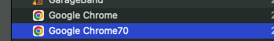
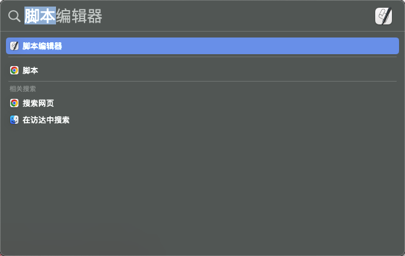
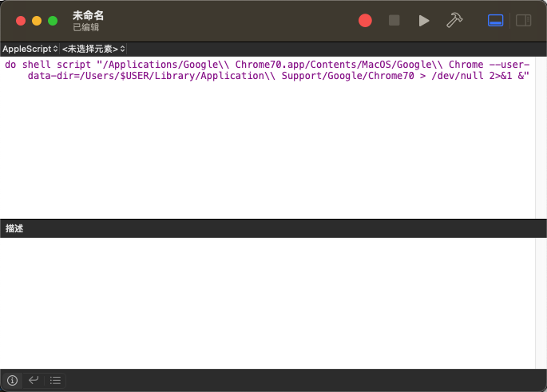
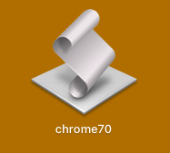
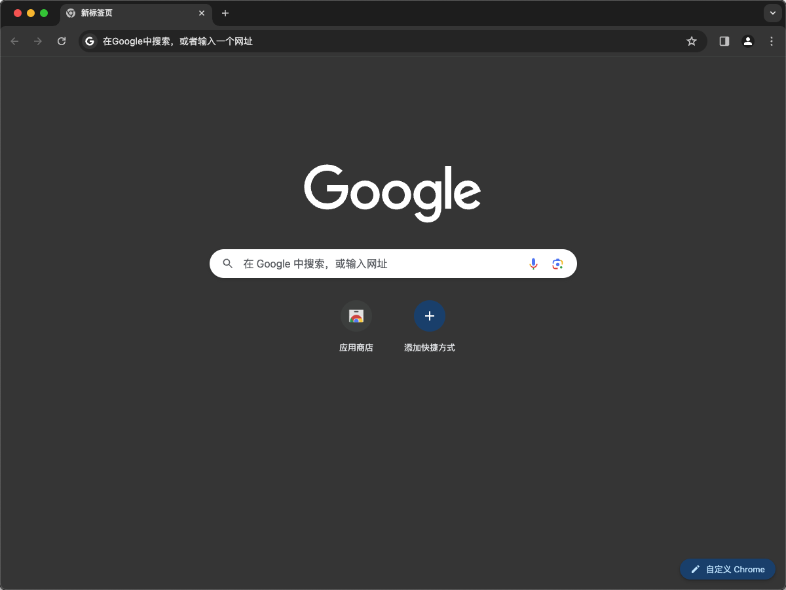

## 1、下载特定的 Chrome 版本

自行下载需要安装的浏览器版本，下面的地址中可以下载对应需要的版本：

- [地址 1](https://www.chromedownloads.net/chrome64osx-stable/)
- [地址 2](https://vikyd.github.io/download-chromium-history-version/#/)
- 或者其他地方下载

<!--truncate-->

## 2、安装对应的 Chrome 版本，并重命名

例如下载的是 `2018-11-10` 的 `70.0.3538.102` 版本。

- 点击安装包后，将对应的 Chrome 程序拖动到 Application 中，**并选中保留两者**如下图：



- 在“应用程序” 中会新增一个 `Google Chrome2` 的程序项。


- 把 `Google Chrome2` 重命名为 `Googole Chrome70`



## 3、制作快捷方式，书写快捷方式脚本

- `command + 空格`，然后搜索“脚本编辑器”，然后打开脚本编辑器“新建文稿”，如下图：



- 复制如下脚本，不同版本只需修改对应的版本数字即可：

```shell
do shell script "/Applications/Google\\ Chrome70.app/Contents/MacOS/Google\\ Chrome --user-data-dir=/Users/$USER/Library/Application\\ Support/Google/Chrome70 > /dev/null 2>&1 &"
```



## 4、保存快捷方式脚本

- `command + s` 保存，并命名为 `chrome70`，文件格式为 “应用程序”。


## 5、启动台打开新的 Chrome

在“启动台”中可以看到我们刚保存的应用程序快捷方式脚本，点击打开脚步即可打开特定版本的 Google Chrome 浏览器。




