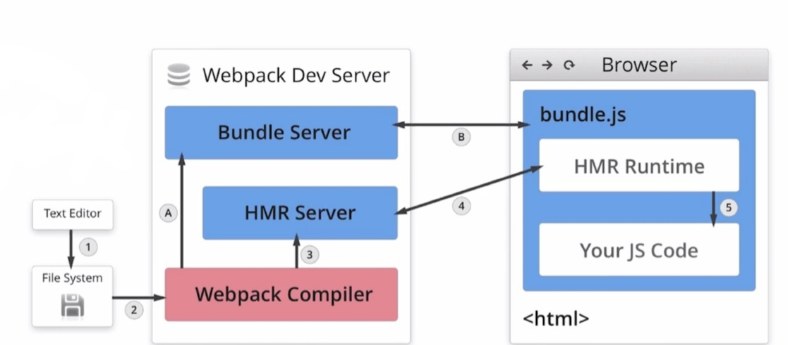
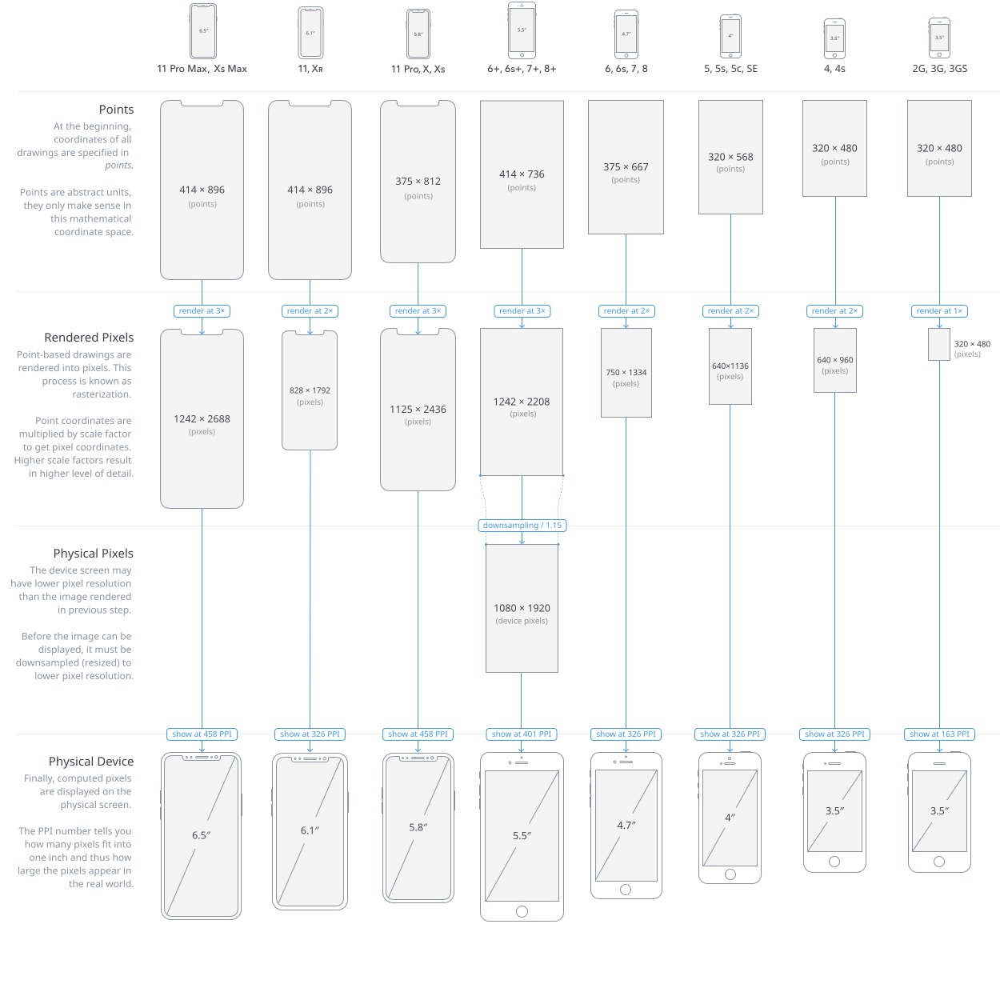
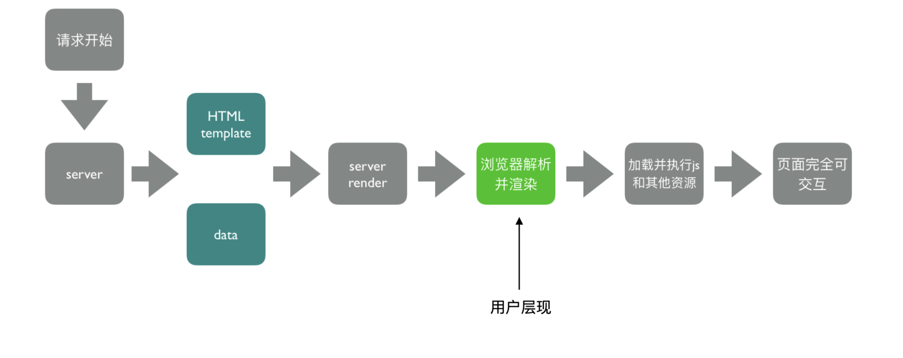
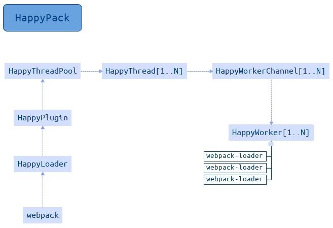

## 前言

Webpack 可以应用于多页面打包、SSR、PWA、Prerender 等多种构建场景，同时支持多实例构建、并行压缩、公共资源分包、Tree Shaking、动态 polyfill 等构建策略。 这个笔记使得我对 webpack 构建的打包速度和体积优化有了非常丰富的经验。同时使得对前端工作流和团队开发规范实施有了深刻的认识。

<!--truncate-->

## 基础

webpack 的基本概念和日常开发的使用技巧。

### webpack 与构建发展历史

#### 为什么要构建工具

- 转换 ES6 语法
- 转换 JSX
- CSS 前缀补全/预处理
- 压缩混淆
- 图片压缩
- 多终端的开发需要兼顾 PC、H5 等各类不同分辨率的网页开发，因此针对不同的应用场景做不同的打包显得很重要。PC（SPA）H5（SSR、PWA）。
- Nodejs 社区繁荣，复用 npm 包。

#### webpack 优势

- 社区活跃、社区生态丰富、配置灵活和插件化扩展、官方更新迭代速度快（取长补短）

#### 初识 webpack：配置文件名称

- webpack 默认配置文件：`webpack.config.js`
- 可以通过 `webpack --config` 指定配置文件

#### 初识 webpack：webpack 配置组成部分

```js
module.exports = {
  // 打包入口文件（零配置的默认配置）
  entry: './src/index.js',
  // 打包输出文件（零配置的默认配置）
  output: './dist/main.js',
  // 当前打包环境（模式） production/development
  mode: 'production',
  // 模块 lodader 配置
  module: {
    rules: [{ test: /\.txt$/, use: 'raw-loader' }],
  },
  // 插件配置
  plugins: [
    new HtmlWebpackPlugin({
      template: './src/index.html',
    }),
  ],
};
```

#### 安装

`webpack` 内核和 `webpack-cli` cli 工具

#### 简单的例子

```js
const path = require('path');

module.exports = {
  entry: './src/index.js',
  output: {
    path: path.join(__dirname, 'dist'),
    filename: 'bundle.js',
  },
  mode: 'production',
};
```

#### 通过 npm script 运行 webpack

在 `package.json` 的 `scritps` 中添加 `build` 命令，通过 `npm run build` 运行构建。原理：模块局部安装后会在 `node_modules/.bin` 目录创建软链接。

```json
{
  "scripts": {
    "build": "webpack"
  }
}
```

### webpack 基础用法

#### webpack 核心概念之 entry 用法

`entry` 用来指定 webpack 的打包入口。webpack 是一个模块打包器，对任何资源当成一个模块，模块之间存在依赖关系，webpack 通过入口文件去找到模块的依赖，构成一个依赖树（图）。最终遍历完后才生成打包资源。

单入口：entry 是一个字符串

```js
module.exports = {
  entry: './path/to/my/entry/file.js',
};
```

多入口：entry 是一个对象

```js
module.exports = {
  entry: {
    app: './src/app.js',
    adminApp: './src/adminApp.js',
  },
};
```

#### webpack 核心概念之 output 用法

`output` 用来指定 webpack 如何将编译后的文件输出到磁盘。

output 用法：多入口配置

```js
module.exports = {
  entry: {
    app: './src/app.js',
    search: './src/search.js',
  },
  output: {
    // 通过占位符确保文件名称唯一
    filename: '[name].js',
    path: path.join(__dirname, 'dist'),
  },
};
```

#### webpack 核心概念之 loaders 用法

webpack 开箱即用只支持 js 和 json 两种文件类型，通过 loaders 去支持其他文件类型，并且把它们转换成有效的模块，使其可以添加到依赖图中。它本身是一个函数，接受源文件作为参数，返回转换后的结果。

##### 常见的 loaders 有哪些？

| 名称          | 描述                          |
| ------------- | ----------------------------- |
| babel-loader  | 转换 ES6、ES7 等 JS 特性语法  |
| css-loader    | 支持 css 文件的加载和解析     |
| less-loader   | 支持 less 文件转换成 css 文件 |
| ts-loader     | 将 ts 文件转换成 js 文件      |
| file-loader   | 进行图片、字体等文件的打包    |
| raw-loader    | 将文件以字符串的形式导入      |
| thread-loader | 多进程打包 js 和 css          |

更多 [loaders](https://webpack.js.org/loaders/)

##### loaders 的用法

```js
module.exports = {
  // 模块 lodader 配置
  module: {
    // test 指定匹配规则，use 指定使用的 loader 名称
    //
    rules: [{ test: /\.txt$/, use: 'raw-loader' }],
  },
};
```

```js
module.exports = {
  module: {
    rules: [
      {
        test: /\.css$/i,
        // 包含配置选项，loader 是 use: [{ loader }] 的快捷方式
        loader: 'css-loader',
        // options 是 use: [{ options }]是的快捷方式
        options: {
          modules: true,
        },
      },
    ],
  },
};
```

#### webpack 核心概念之 plugins 用法

`plugins` 用于 bundle 文件（输出文件）的优化，资源管理和环境变量注入。作用于整个过程。

##### 常见的 plugins 有哪些？

| 名称                 | 描述                                             |
| -------------------- | ------------------------------------------------ |
| CommonsChunkPlugin   | 将 chunks 相同的模块代码提取成公共 js            |
| CleanWebpackPlugin   | 清理构建目录                                     |
| MiniCssExtractPlugin | 将 css 从 bundle 文件中提取成一个独立的 css 文件 |
| CopyWebpackPlugin    | 将文件或者文件夹拷贝到构建的输出目录             |
| HtmlWebpackPlugin    | 创建 html 文件去承载输出的 bundle                |
| TerserWebpackPlugin  | 用 Terser 压缩 js                                |
| ZipWebpackPlugin     | 将打包出的资源生成一个 zip 包                    |

更多 [plugins](https://webpack.js.org/plugins/)

##### plugins 的用法

```js
module.exports = {
  // 将插件配置放到 plugins 数组中
  plugins: [
    new HtmlWebpackPlugin({
      template: './src/index.html',
    }),
  ],
};
```

#### webpack 核心概念之 mode 用法

mode 用来指定当前的构建环境：`production`、`development` 还是 `none`。设置 mode 可以自动触发 webpack 内置的函数，默认在当前构建中开启一些参数和功能配置。默认值为 `production`。

##### mode 中内置函数功能

| 选项        | 描述                                                                                                                                                                                                                                      |
| ----------- | ----------------------------------------------------------------------------------------------------------------------------------------------------------------------------------------------------------------------------------------- |
| development | 设置 `process.env.NODE_ENV` 的值为 `devlopment`，开启 `NamedChunksPlugin` 和 `NamedModulesPlugin`                                                                                                                                         |
| production  | 设置 `process.env.NODE_ENV` 的值为 `production`，开启 `FlagDependencyUsagePlugin`，`FlagIncludedChunksPlugin`，`ModuleConcatenationPlugin`，`NoEmitOnErrorsPlugin`，`OccurrenceOrderPlugin`，`SideEffectsFlagPlugin` 和 `TerserPlugin` 。 |
| none        | 不开启任何优化选项                                                                                                                                                                                                                        |

#### 资源解析：解析 ES6 和 React JSX

使用 babel-loader，babel 的配置文件是：.babelrc 或 babel.config.js

```js
// webpack.config.js
module.exports = {
  module: {
    rules: [
      {
        test: /\.js$/,
        use: 'babel-loader',
      },
    ],
  },
};
```

```js
// babel.config.js
module.exports = {
  // 增加 es6 和 react 的 babel preset 配置
  presets: ['@babel/preset-env', '@babel/preset-react'],
  // 支持类
  plugins: ['@babel/proposal-class-properties'],
};
```

更多 [babel-loader](https://webpack.js.org/loaders/babel-loader) 和 [babel](https://babel.dev/docs/en/)

#### 资源解析：解析 CSS

css-loader 用于解析和加载 css 文件，并且转换成 commonjs 对象。style-loader 将样式通过 `<style>` 标签插入到 html 的 head 标签中。

```js
// webpack.config.js
module.exports = {
  module: {
    rules: [
      {
        test: /\.css$/,
        // 注意 loader 是链式调用，执行顺序从右到左
        use: ['style-loader', 'css-loader'],
      },
    ],
  },
};
```

更多 [style-loader](https://webpack.js.org/loaders/style-loader/) 和 [css-loader](https://webpack.js.org/loaders/css-loader/) 配置

#### 资源解析：解析 less 和 sass

less-loader 用于将 less 转换成 css。

```js diff
// webpack.config.js
module.exports = {
  module: {
    rules: [
      {
        test: /\.less$/,
        // 添加 less-loader
        use: ['style-loader', 'css-loader', 'less-loader'],
      },
    ],
  },
};
```

更多 [less-loader](https://webpack.js.org/loaders/less-loader/) 和 [sass-loader](https://webpack.js.org/loaders/sass-loader/) 配置

#### 资源解析：解析图片

file-loader 用于处理文件。

```js
module.exports = {
  module: {
    rules: [
      {
        test: /\.(png|svg|jpg|gif)/,
        use: ['file-loader'],
      },
    ],
  },
};
```

更多 [file-loader](https://webpack.js.org/loaders/file-loader/) 配置

#### 资源解析：url-loader

url-loader 也可以处理图片和字体等资源，可以设置较小的资源自动以 base64 的方式插入。内部也使用了 file-loader。

```js
module.exports = {
  module: {
    rules: [
      {
        test: /\.(png|svg|jpg|gif)/,
        use: [
          {
            loader: 'url-loader',
            options: {
              // 小于 10k 自动转为 base64
              limit: 10240,
            },
          },
        ],
      },
    ],
  },
};
```

更多 [url-loader](https://webpack.js.org/loaders/url-loader/) 配置

#### webpack 中的文件监听

文件监听是在发现源码发生变化的时候，自动重新构建出来新的输出文件。缺点是每次打包后需要手动刷新浏览器。webpack 开启监听模式有两种方式：

- 启动 webpack 命令时，带上 `--watch` 参数
- 在配置 `webpack.config.js` 中设置 `watch: true`

##### 文件监听的原理分析

轮询判断文件的最后编辑时间是否变化。某个文件发生了变化，并不会立刻告知监听这，而是缓存起来，等 `aggregateTimeout`。

```js
module.exports = {
  // 默认是 false，即不开启
  watch: true,
  // 只有开启监听模式时，watchOptions 才生效
  watchOptions: {
    // 默认为空，不监听的文件或文件夹，支持正则匹配
    ignored: /node_modules/,
    // 监听到变化发生后会等待 300ms 再去执行，默认 300ms
    aggregateTimeout: 300,
    // 判断文件是否发生变化是通过不停的询问系统指定文件有没有变化实现的，默认每秒问 1000 次
    poll: 1000,
  },
};
```

更多 [watch](https://webpack.js.org/configuration/watch/) 配置

#### webpack 中的热更新

##### 热更新：使用 webpack-dev-server

WDS 不需要手动刷新浏览器；不输出文件，没有磁盘的 io，而是放在内存中；通常和 HotModuleReplacementPlugin 插件结合使用。在 package.json 中添加命令：

```json
{
  "scripts": {
    "dev": "webpack-dev-server --open"
  }
}
```

```js
const webpack = require('webpack');
module.exports = {
  // 引入 HMR 插件
  plugins: [new webpack.HotModuleReplacementPlugin()],
  // 配置 devServer
  devServer: {
    contentBase: './dist',
    hot: true,
  },
};
```

更多 [HMR](https://webpack.js.org/plugins/hot-module-replacement-plugin/)、[dev-server](https://webpack.js.org/configuration/dev-server/) 和 [using-webpack-dev-server](https://webpack.js.org/guides/development/#using-webpack-dev-server)

##### 热更新：webpack-dev-middleware

WDM 将 webpack 输出的文件传输给服务器，使用于灵活定制的场景。

```js
// server.js
const express = require('express');
const webpack = require('webpack');
const webpackDevMiddleware = require('webpack-dev-middleware');

const app = express();
const config = require('./webpack.config.js');
const compiler = webpack(config);

// Tell express to use the webpack-dev-middleware and use the webpack.config.js
// configuration file as a base.
app.use(
  webpackDevMiddleware(compiler, {
    publicPath: config.output.publicPath,
  }),
);

// Serve the files on port 3000.
app.listen(3000, function () {
  console.log('Example app listening on port 3000!\n');
});
```

更多 [using-webpack-dev-middleware](https://webpack.js.org/guides/development/#using-webpack-dev-middleware) 和 [webpack-dev-middleware](https://github.com/webpack/webpack-dev-middleware)

##### 热更新的原理

相关概念：

- webpack compile（webpack 编译器）：将 js（源代码）编译成 bundle（打包输出的文件）
- HMR server：将热更新的文件输出给 HMR runtime
- bundle server：提供文件在浏览器的访问（以服务器的方式访问 localhost: 8080）
- HMR runtime：会注入到浏览器（将文件注入 bundle 里面，bundle 可以和服务器建立 socket 连接），更新文件变化
- bundle.js：构建输出的文件



1. 当修改了一个或多个文件（js）；
2. 文件系统接收更改并通知 webpack；
3. webpack 重新编译构建一个或多个模块，并通知 HMR 服务器进行更新；
4. HMR Server 使用 WebSocket 通知 HMR runtime 需要更新，HMR 运行时通过 HTTP 请求更新 jsonp；
5. HMR 运行时替换更新中的模块，如果确定这些模块无法更新，则触发整个页面刷新。

[webpack HMR 文档](https://webpack.docschina.org/concepts/hot-module-replacement/)

#### webpack 中文件指纹策略：chunkhash、contenthash 和 hash

打包出来的文件名带哈希值，版本的管理，对没有修改的文件仍然可以使用本地缓存。

- **Hash：** 和整个项目的构建相关，只要项目文件有修改，整个项目构建的 hash 值就会更改。webpack 启动的时候创建 compiler 对象，compilation 每次文件发生变化后会变化，导致 hash 变化。
- **Chunkhash：** 和 webpack 打包的 chunk 有关，不同的 entry 会生成不同的 chunkhash 值。（js）
- **Contenthash** 根据文件内容定义 hash，文件内容不变，则 contenthash 不变。（css）

##### 文件指纹设置

- 对于 js 通常设置 output 的 `filename` 属性，使用 `[chunkhash]`。（umi 、vue-cli 和 cra 使用 `[contenthash:8]`）
- 对于 css 设置 MiniCssExtractPlugin 的 `filename`，使用 `[contenthash]`。
- 对于图片、字体等资源设置 file-loader 的 `name`，使用 `[hash]`。

file-loader 占位符：

| 占位符名称    | 含义                             |
| ------------- | -------------------------------- |
| [ext]         | 资源后缀                         |
| [name]        | 文件名称                         |
| [path]        | 文件的相对路径                   |
| [folder]      | 文件所在的文件夹                 |
| [contenthash] | 文件内容的 hash，默认是 md5 生成 |
| [hash]        | 文件内容的 hash，默认是 md5 生成 |
| [emoji]       | 一个随机的指代文件内容的 emoj    |

```js
module.exports = {
  output: {
    // js 文件指纹设置
    filename: '[name][chunkhash:8].js',
  },
  module: {
    rules: [
      {
        test: /\.(png|svg|jpg|gif)/,
        use: [
          {
            loader: 'file-loader',
            // 图片等资源文件指纹
            options: {
              name: 'img/[name][hash:8][ext]',
            },
          },
        ],
      },
    ],
  },
  plugins: [
    new MiniCssExtractPlugin({
      // css 文件指纹设置
      filename: '[name][contenthash:8].css',
    }),
  ],
};
```

更多 [output filename](https://webpack.js.org/configuration/output/#outputfilename)、[mini-css-extract-plugin](https://webpack.js.org/plugins/mini-css-extract-plugin/) 和 [file-loader](https://webpack.js.org/loaders/file-loader/#name)

#### webpack 代码压缩

##### js 文件的压缩

使用插件 [terser-webpack-plugin](https://webpack.js.org/plugins/terser-webpack-plugin/) 支持 es6 代码压缩。

##### css 文件压缩

使用 [optimize-css-assets-webpack-plugin](https://github.com/NMFR/optimize-css-assets-webpack-plugin)，可以同时配合 [cssnano](https://github.com/cssnano/cssnano)

```js
module.exports = {
  plugins: [
    new OptimizeCSSAssetsPlugin({
      assetNameRegExp: /\.optimize\.css$/g,
      cssProcessor: require('cssnano'),
    }),
  ],
};
```

##### html 文件压缩

配置 [html-webpack-plugin](https://github.com/jantimon/html-webpack-plugin)，设置压缩参数

```js
module.exports = {
  plugins: [
    new HtmlWebpackPlugin({
      template: path.join(__dirname, 'src/index.html'),
      inject: true,
      // 压缩
      minify: {
        removeComments: true,
        collapseWhitespace: true,
        removeRedundantAttributes: true,
        useShortDoctype: true,
        removeEmptyAttributes: true,
        removeStyleLinkTypeAttributes: true,
        keepClosingSlash: true,
        minifyJS: true,
        minifyCSS: true,
        minifyURLs: true,
      },
    }),
  ],
};
```

### webpack 进阶用法

#### 自动清理构建目录产物

每次构建的时候不会清理目录，造成构建输出目录 output 文件越来越多。

- 通过 npm scripts 清理构建目录
  - `rm -rf ./dist && webpack`
  - `rimraf ./dist && webpack`
- webpack 自动清理目录插件 `clean-webpack-plugin`，默认会删除 output 指定的输出目录

```js
module.export = {
  plugins: [new CleanWebpackPlugin()],
};
```

#### webpack 中增强 css 功能

CSS3 标准没有同一不同浏览器厂商内核不同，Firefox Gecko（-moz），Chrome Webkit（-webkit），Opera Presto（-o），导致需要根据不同的浏览器添加不同的前缀。

最新的浏览器内核情况：

- Google Chrom 内核：统称为 Chromium 内核或 Chrome 内核，以前是 Webkit 内核，现在是 Blink 内核。
- IE 浏览器内核：Trident 内核，也是俗称的 IE 内核。
- Edge 浏览器内核， Chromium 内核。
- Firefox 浏览器内核：Gecko 内核，俗称 Firefox 内核。
- Safari 浏览器内核：Webkit 内核。
- Opera 浏览器内核：最初是自己的 Presto 内核，后来是 Webkit，现在是 Blink 内核;

```css
.box {
  -moz-border-radius: 10px;
  -webkit-border-radius: 10px;
  -o-border-radius: 10px;
  border-radius: 10px;
}
```

##### PostCSS 插件 autoprefixer 自动补全 CSS3 前缀

使用 [postcss-loader](https://webpack.js.org/loaders/postcss-loader) 的 [autoprefixer](https://github.com/postcss/autoprefixer) 插件，根据 [Can I Use](https://caniuse.com/) 规则。也可以使用包含 autprefixer 的 [postcss-preset-env](https://github.com/csstools/postcss-preset-env)

```js
module.exports = {
  module: {
    rules: [
      {
        test: /\.css$/,
        use: [
          'style-loader',
          'css-loader',
          {
            loader: 'postcss-loader',
            options: {
              ident: 'postcss',
              plugins: [
                require('autoprefixer')({
                  // ...options
                  browsers: ['last 2 version', '>1%', 'ios 7'],
                }),
              ],
            },
          },
        ],
      },
    ],
  },
};
```

##### 移动端 CSS px 自动转换成 rem

不同设备浏览器的分辨率都不尽相同。


- 方案一：CSS 媒体查询实现响应式布局，缺陷：需要写多套适配的样式代码

```css
@media screen and (max-width: 980px) {
  .header {
    width: 900px;
  }
}
@media screen and (max-width: 480px) {
  .header {
    width: 400px;
  }
}
@media screen and (max-width: 350px) {
  .header {
    width: 300px;
  }
}
```

- 方案二：rem。W3C 对 rem 的定义：font-size of the root element。rem 是相对单位，px 是决对单位
  - 第一步：使用 [px2rem-loader](https://github.com/Jinjiang/px2rem-loader)
  - 第二步：配合页面渲染是计算根元素的 font-size 值，可以使用手淘的 [lib-flexible](https://gihtub.com/amfe/lib-flexible) 库

```js
module.exports = {
  // ...
  module: {
    rules: [
      {
        test: /\.css$/,
        use: [
          'style-loader',
          'css-loader',
          {
            loader: 'px2rem-loader',
            // options here
            options: {
              // rem 相对 px 的单位，默认 75，1rem == 75px 适合 750 的设计稿
              remUnit: 75,
              // 小数点位数
              remPrecision: 8,
            },
          },
        ],
      },
    ],
  },
};
```

#### 静态资源内联

资源内联的意义：

- 代码层面
  - 页面框架的初始化脚本
  - 上报相关点
  - css 内联避免页面闪动
- 请求层面：减少 http 网络请求数
  - 小图片或者字体内联（url-loader）

##### html 和 js 的内联

- [raw-loader](https://webpack.js.org/loaders/raw-loader/) 内联 html `<script>${require('raw-loader!babel-loader!./meta.html')}</script>`
- [raw-loader](https://webpack.js.org/loaders/raw-loader/) 内联 js
  `<script>${require('raw-loader!babel-loader!../node_modules/lib-flexible')}</script>`

使用 raw-loader v0.5 的版本，最新版本有点问题。

##### css 的内联

- 方案一：借助 [style-loader](https://webpack.js.org/loaders/style-loader/)
- 方案二：[html-inline-css-webpack-plugin](https://github.com/Runjuu/html-inline-css-webpack-plugin#readme)

其他 [html-webpack-tags-plugin](https://github.com/jharris4/html-webpack-tags-plugin)

#### 多页面应用打包

多页面应用（MPA）：每次页面跳转的时候，后台服务器都会返回一个新的 html 文档，这种类型的网站就是多页网站，也叫做多页应用。页面解藕、seo 友好。

##### 多页应用打包基本思路

每个页面对应一个 entry，一个 html-webpack-plugin。缺点是：每次新增页面或删除页面都需要修改 webpack 配置。

```js
module.exports = {
  entry: {
    index: './src/index.js',
    search: './src/search.js',
  },
};
```

##### 多页应用打包通用方案

动态获取 entry 和设置 html-webpack-plugin 数量，利用 [glob](https://github.com/isaacs/node-glob#readme) 匹配 src 下文件夹中的 index.js，`entry: glob.sync(path.join(__dirname, './src/*/index.js'))`。

```js
module.exports = {
  entry: {
    index: './src/index/index.js',
    search: './src/search/index.js',
    // ...
  },
};
```

编写读取函数：

```js
const glob = require('glob');
// 函数
const setMPA = () => {
  const entry = {};
  const htmlWebpackPlugins = [];

  const entryFiles = glob.sync(path.join(__dirname, './src/*/index.js'));
  Object.keys(entryFiles).map((index) => {
    const entryFile = entryFiles[index];
    const match = entryFile.match(/src\(.*)\/index\.js/);
    const pageName = match && match[1];
    entry[pageName] = entryFile;
    htmlWebpackPlugins.push(
      new HtmlWebpackPlugin({
        template: path.join(__dirname, `src/${pageName}/index.html`),
        filename: `${pageName}.html`,
        chunks: [pageName],
        // ...
      }),
    );
  });

  return {
    entry,
    htmlWebpackPlugin,
  };
};
```

webpack 配置：

```js
const { entry, htmlWebpackPlugins } = setMPA();
module.exports = {
  entry,
  plugins: [...htmlWebpackPlugins],
};
```

#### 使用 source map

- 作用：通过 source map 定位到源代码。[source map 科普文](https://www.ruanyifeng.com/blog/2013/01/javascript_source_map.html)
- 开发环境开启，线上环境关闭（线上排查问题时可以将 sourcemap 上传到错误监控系统）
- eval：使用 eval 包裹模块代码
- source map：产生 .map 文件
- cheap：不包含列信息
- inline：将 .map 作为 DataURI 嵌入，不单独生成 .map 文件
- module：包含 loader 的 sourcemap

[webpack devtool](https://webpack.docschina.org/configuration/devtool/#devtool)

#### 提取公共资源

##### 基础库分离

- 思路：将 react、react-dom 基础包通过 cdn 引入，不打入 bundle 中
- 方法：使用 [html-webpack-external-plugin](https://github.com/mmiller42/html-webpack-externals-plugin#readme)

```js
const HtmlWebpackExternalsPlugin = require('html-webpack-externals-plugin');
module.exports = {
  plugins: [
    new HtmlWebpackPlugin(),
    new HtmlWebpackExternalsPlugin({
      externals: [
        {
          module: 'react',
          entry: '//xxx/react.min.js',
          global: 'React',
        },
      ],
    }),
  ],
};
```

##### 利用 SplitChunksPlugin 进行公共脚本分离

webpack 4 内置 [SplitChunkPlugin](https://webpack.js.org/plugins/split-chunks-plugin/#root)，替代 CommonsChunkPlugin 插件。chunks 参数说明：

- async 异步引入的库进行分离（默认）
- initial 同步引入的库进行分离
- all 所有引入的库进行分离（推荐）

```js
module.exports = {
  //...
  optimization: {
    splitChunks: {
      chunks: 'async',
      minSize: 20000,
      minRemainingSize: 0,
      maxSize: 0,
      minChunks: 1,
      maxAsyncRequests: 6,
      maxInitialRequests: 4,
      automaticNameDelimiter: '~',
      enforceSizeThreshold: 50000,
      cacheGroups: {
        defaultVendors: {
          test: /[\\/]node_modules[\\/]/,
          priority: -10,
        },
        default: {
          minChunks: 2,
          priority: -20,
          reuseExistingChunk: true,
        },
      },
    },
  },
};
```

##### 利用 SplitChunksPlugin 分离基础包

```js
module.exports = {
  optimization: {
    splitChunks: {
      cacheGroups: {
        commons: {
          // test：匹配出需要分离的包
          test: /(react|react-dom)/,
          name: 'vendors',
          chunks: 'all',
        },
      },
    },
  },
};
```

```js
module.exports = {
  optimization: {
    splitChunks: {
      // 分离的包体积的大小
      minSize: 0,
      cacheGroups: {
        commons: {
          name: 'commons',
          chunks: 'all',
          // 设置最小引用次数为 2 次
          minChunks: 2,
        },
      },
    },
  },
};
```

#### tree shaking（摇树优化）

- 概念：1 个模块可能有多个方法，只要其中的某个方法使用到了，则整个文件都会被打到 bundle 里，tree shaking 就是只把用到的方法打到 bundle 中，没用到的方法不会在 uglify 阶段被擦除掉。简单来说移除 JS 上下文中的未引用代码(dead-code)。
- 使用
  - webpack 默认支持，在 `.babelrc` 里面设置 `modules: false` (默认为 auto)即可。
  - 在项目的 package.json 文件中，添加 "sideEffects" 属性。
  - 设置 mode 为 "production" 的配置项以启用更多优化项，包括压缩代码与 tree shaking。
- 要求：
  - 使用 ES2015 模块语法的[静态结构](https://exploringjs.com/es6/ch_modules.html#static-module-structure) 特性（即 import 和 export），CJS 的方式不支持。
  - 确保没有编译器将您的 ES2015 模块语法转换为 CommonJS 的（顺带一提，这是现在常用的 @babel/preset-env 的默认行为，详细信息请参阅[文档](https://babeljs.io/docs/en/babel-preset-env#modules)）。

##### 原理

DCE（Elimination）：未引用代码（dead-code）清除

- 代码不会被执行，不可到达
- 代码执行的结果不会被用到
- 代码只会影响死变量（只写不读）

```js
if (false) {
  console.log('这段代码永远不会执行');
}
```

原理：

- 利用 ES6 模块的特点：静态分析，模块输出的是值的引用，编译时确定模块。
  - 只能作为模块顶层的语法出现
  - import 的模块名只能是字符串常量
  - import binding 是 immutable 的
- 代码擦除
  - uglify 阶段删除无用代码。添加注释标记，代码转换为 ast，在 ast 转换阶段进行剔除，生成打包文件。

[](https://juejin.im/post/6844903544756109319)

#### Scope Hoisting 使用和原理

- 未使用前的现象：构建后的代码存在大量闭包代码，每个模块都用一个函数包裹。
- 导致的问题
  - 大量函数闭包包裹代码，会导致体积增多（模块越多越明显）
  - 运行代码时创建的函数作用域变多，内存开销变大

模块转换（机制）分析：

- 被 webpack 转换后的模块会带上一层包裹
- import 会被转换成 `__webpack_require__(模块id)`，例如：`__webpack_require__(1)`
- 打包出来是一个 IIFE（匿名闭包）
- modules 是一个数组，每一项是一个模块初始化函数
- `__webpack_require__` 用来加载模块，返回 module.exports
- 通过 WEBPACK_REQUIRE_METHOD(0) 启动程序

```js
// modules是存放所有模块的数组，数组中每个元素存储{ 模块路径: 模块导出代码函数 }
(function (modules) {
  // 模块缓存作用，已加载的模块可以不用再重新读取，提升性能
  var installedModules = {};

  // 关键函数，加载模块代码
  // 形式有点像 Node 的 CommonJS 模块，但这里是可跑在浏览器上的 es5 代码
  function __webpack_require__(moduleId) {
    // 缓存检查，有则直接从缓存中取得
    if (installedModules[moduleId]) {
      return installedModules[moduleId].exports;
    }
    // 先创建一个空模块，塞入缓存中
    var module = (installedModules[moduleId] = {
      i: moduleId,
      l: false, // 标记是否已经加载
      exports: {}, // 初始模块为空
    });

    // 把要加载的模块内容，挂载到module.exports上
    modules[moduleId].call(module.exports, module, module.exports, __webpack_require__);
    module.l = true; // 标记为已加载

    // 返回加载的模块，调用方直接调用即可
    return module.exports;
  }
  __webpack_require__(0);
})([
  // 0 为入口模块
  /* 0 module */
  function (module, __webpack_exports__, __webpack_require__) {
    //...
  },
  /* 1 module */
  function (module, __webpack_exports__, __webpack_require__) {
    //...
  },
  /* n module */
  function (module, __webpack_exports__, __webpack_require__) {
    //...
  },
]);
```

[Webpack 模块打包原理](https://juejin.im/post/5c94a2f36fb9a070fc623df4)

##### scope hositing 原理

- 原理：将所有模块的代码按照引用顺序放在一个函数作用域里，然后适当重命名一些变量以防止变量名冲突
- 对比：通过 scope hositing 可以减少函数声明代码和内存开销

##### scope hositing 使用

webpack mode 设置为 `production` 默认开启（插件 [ModuleConcatenationPlugin](https://webpack.docschina.org/plugins/module-concatenation-plugin/#root)），必须是 ES6 语法，CJS 不支持。

```js
module.exports = {
  plugins: [new webpack.optimize.ModuleConcatenationPlugin()],
};
```

#### 代码分割和动态 import

##### 代码分割

- 意义：对于大的 web 应用来说，将所有的代码放到一个文件中显然是不够有效的，特别是当你的某些代码是在某些特殊时候才会被用到。webpack 有个功能是将你的代码库分割成 chunks（语块），当代码运行到需要它们的时候再进行加载。
- 适用场景：
  - 抽离相同代码到一个共享块
  - 脚本懒加载，使得初始下载代码更小

懒加载 js 脚本的方式

- commonjs：require.ensure
- es6：动态 import（目前还没有原生支持，需要 babel 转换）

##### 动态 import

如何使用动态 import？

1. 安装 babel 插件。

`npm i @babel/plugin-syntax-dynamic-import -D`

2. 配置 babel

```json
{
  "plugins": ["@babel/plugin-syntax-dynamic-import"]
}
```

#### webpack 打包库和组件

webpack 除了可以用来打包应用外，也可以用来打包 js 库。（rollup 更加合适）

实现一个大整数加法的库的打包：

- 需要打包压缩版（large-number-min.js）和非压缩版（large-number.js）
- 支持 AMD/CJS/ESM 模块引入和 script 标签引入

```js
// 支持 ES modules
import * as largeNumber from 'large-number';
// ...
largeNumber.add('999', '1');

// 支持 CJS
const largeNumber = require('large-number');
// ...
largeNumber.add('999', '1');

// 支持 AMD
require(['large-number'], function (largeNumber) {
  // ...
  largeNumber.add('999', '1');
});
```

如何暴露出去？

- library：指定库的全局变量
- libraryTarget：指定库引入的方式

```js
module.exports = {
  mode: 'none',
  entry: {
    'large-nubmer': './src/index.js',
    'large-nubmer.min': './src/index.js',
  },
  output: {
    filename: '[name].js',
    library: 'largeNumber',
    libraryExport: 'default',
    libraryTarget: 'umd',
  },
  optimization: {
    minimize: true,
    minimizer: [
      new TerserPlugin({
        include: /\.min\.js$/,
      }),
    ],
  },
};
```

[实现两个大整数加法](https://kenve.github.io/docs/interview/js/handwritten-code/#%E5%AE%9E%E7%8E%B0%E4%B8%A4%E4%B8%AA%E5%A4%A7%E6%95%B4%E6%95%B0%E5%8A%A0%E6%B3%95)

设置入口文件：package.json 的 main 字段为 index.js

```js
// index.js
if (process.env.NODE_ENV === 'production') {
  module.exports = require('./dist/large-number.min.js');
} else {
  module.exports = require('./dist/large-number.js');
}
```

#### webpack 实现 SSR 打包

服务端渲染（SSR）是什么？

- 渲染：HTML + CSS + JS + Data => 渲染后的 HTML
- 服务端：
  - 所有模版等资源都存储在服务端
  - 内网机器拉取数据更快
  - 一个 HTML 返回所有数据

浏览器和服务器交互流程：



客户端渲染 vs 服务端渲染


SSR 优势：减少白屏时间，对于 SEO 友好

##### SSR 代码实现思路

- 服务端：
  - 使用 react-dom/server 的 renderToString 方法将 React 组件渲染成字符串
  - 服务端路由返回对应的模版
- 客户端
  - 打包正对服务端的组件

新增 webpack.ssr.config.js

```js
module.exports = {
  // ssr 的 entry 为 /src/*/index-server.js
  entry: entry,
  output: {
    path: path.join(__dirname, 'dist'),
    // name-server
    filename: '[name]-server.js',
    // umd
    libraryTarget: 'umd',
  },
  mode: 'none',
};
```

新增 server/index.js

```js
// hack 解决 window 为 undefined 的问题
if (typeof window === 'undefined') {
  global.window = {};
}

const fs = require('fs');
const path = require('path');
const express = require('express');
const { renderToString } = require('react-dom/server');
// seach server 端 js 资源
const SSR = require('../dist/search-server');
// html 模版
const template = fs.readFileSync(path.join(__dirname, '../dist/search.html'), 'utf-8');
const data = require('./data.json');

const server = (port) => {
  const app = express();

  app.use(express.static('dist'));
  // 当访问 search 的时候，返回内容
  app.get('/search', (req, res) => {
    const html = renderMarkup(renderToString(SSR));
    res.status(200).send(html);
  });

  app.listen(port, () => {
    console.log('Server is running on port:' + port);
  });
};

server(process.env.PORT || 3000);

// 定义模版方法，返回 html
const renderMarkup = (str) => {
  // json string
  const dataStr = JSON.stringify(data);
  // 使用打包出来的浏览器端 html 为模版
  // 设置占位符，动态插入组件（HTML_PLACEHOLDER 中 插入 css）
  // INITIAL_DATA_PLACEHOLDER 中插入 data
  return template
    .replace('<!--HTML_PLACEHOLDER-->', str)
    .replace(
      '<!--INITIAL_DATA_PLACEHOLDER-->',
      `<script>window.__initial_data=${dataStr}</script>`,
    );
};
```

入口 index-server.js

```js
// import 更改为 require
const React = require('react');

class Search extends React.Component {}

module.exports = <Search />;
```

webpack ssr 打包存在的问题：全局变量、样式不显示、首屏数据

- 浏览器的全局变量（Node.js 中没有 document，window）
  - 组件适配：将不兼容的组件根据打包环境进行适配
  - 请求适配：将 fetch 或者 ajax 发送请求的写法改成 axios 或 isomorphic-fetch 等库
- 样式问题（Node.js 无法解析 css）
  - 方案一：服务端打包通过 ignore-loader 忽略掉 css 的解析（然后通过占位符插入）
  - 方案二：将 style-loader 替换成 isomorphic-style-loader（css in js）
- 首屏数据如何处理？
  - 服务端获取数据
  - 替换占位符

#### 优化构建时命令行的显示日志

统计信息 [stats](https://webpack.docschina.org/configuration/stats/#root)

webpack 有一些特定的预设选项给统计信息输出：

| 预设              | 可选值 | 描述                                          |
| ----------------- | ------ | --------------------------------------------- |
| 'errors-only'     | none   | 只在发生错误时输出                            |
| 'errors-warnings' | none   | 只在发生错误或有新的编译时输出                |
| 'minimal'         | none   | 只在发生错误或新的编译开始时输出              |
| 'none'            | false  | 没有输出                                      |
| 'normal'          | true   | 标准输出                                      |
| 'verbose'         | none   | 全部输出                                      |
| 'detailed'        | none   | 全部输出除了 chunkModules 和 chunkRootModules |

##### 如何优化命令行的构建日志

- 使用 [friendly-errors-webpack-plugin](https://github.com/geowarin/friendly-errors-webpack-plugin#readme)
  - success：构建成供的日志提示
  - warning：构建警告的日志提示
  - error：构建报错的日志提示
- stats 设置成 `error-only`

```js
module.export = {
  stats: 'errors-only',
  plugins: [new FriendlyErrorsWebpackPlugin()],
};
```

#### 构建异常和中断构建

如何判断构建是否成功？

- 在 CI/CD 的 pipline 或者发布系统中需要知道当前构建状态
- 每次构建完成后输入 `echo $?` 获取错误码（不为 0 则为失败）

##### 在 webpack 中构建异常和中断处理

Node.js 中的 `process.exit(number)` 规范：

- 0 表示成功，回调函数中，err 为 null
- 非 0 便是执行失败，回调函数中，err 不为 null，err.code 就是传给 exit 的数字

```js
module.exports = {
  plugins: [
    function () {
      this.hooks.done.tap('done', (stats) => {
        if (
          stats.compilation.errors &&
          stats.compilation.errors.length &&
          process.argv.indexOf('--watch') == -1
        ) {
          // 做数据上报
          console.log('build error');
          process.exit(1);
        }
      });
    },
  ],
};
```

## 进阶篇

以工程化的方式组织 webpack 构建配置和 webpack 打包优化。

### 编写可维护的 webpack 构建配置

#### 构建配置抽离成 npm 包的意义

- 通用性
  - 业务开发者无需关注构建配置
  - 同一团队构建脚本
- 可维护性
  - 构建配置合理的拆分
  - README 文件、ChangeLog 文档等
- 质量
  - 冒烟测试、单元测试、测试覆盖率等
  - 持续集成

#### 构建配置管理的可选方案

- 通过多个配置文件管理不同环境的构建，webpack --config 参数进行控制
- 将构建设计成一个库，比如：hjs-webpack、Neutrino、webpack-blocks
- 抽成一个工具进行管理，比如：create-react-app，kyt，nwb
- 将所有的配置放在一个文件，通过 --env 参数控制分支选择

#### 构建配置包设计

- 通过多个配置文件管理不同环境的 webpack 配置
  - 基础配置：webpack.base.js
  - 开发配置：webpack.dev.js
  - 生产配置：webpack.prod.js
  - SSR 配置：webpack.ssr.js
  - ...
- 抽离成一个 npm 包同一管理
  - 规范：git commit 日志、README、ESLint 规范、Semver 规范。
  - 质量：冒烟测试、单元测试、测试覆盖率和 CI
- 不同环境配置通过 [webpack-merge](https://github.com/survivejs/webpack-merge) 组合 `module.exports = merge(baseConfg, devConfig)`

#### 目录设计

```
.
├── test                   // 放置测试代码
├── lib                    // 放置源代码
│   ├── webpack.dev.js
│   ├── webpack.prod.js
│   ├── webpack.ssr.js
│   └── webpack.base.js
├── README.md
├── CHANGELOG.md
├── .eslintrc.js
├── package.json
└── index.js
```

##### 冒烟测试（smoke testing）

冒烟测试是指对提交测试的软件在进行详细摄入的测试之前而进行的预测试，这种预测试的主要目的是暴露导致软件需要重新发布的基本功能失效等严重问题。

- 构建是否成功
- 每次构建完成 build 目录是否有内容输出
  - 是否有 js、css 资源等资源文件
  - 是否有 html 文件

判断构建是否成功：在示例项目中运行构建，看是否报错

```js
const path = require('path');
const webpack = require('webpack');
const rimraf = require('rimraf');
const Mocha = require('mocha');

const mocha = new Mocha({
  timeout: '10000ms',
});

process.chdir(path.join(__dirname, 'template'));

rimraf('./dist', () => {
  const prodConfig = require('../../lib/webpack.prod.js');

  webpack(prodConfig, (err, stats) => {
    if (err) {
      console.error(err);
      process.exit(2);
    }
    console.log(
      stats.toString({
        colors: true,
        modules: false,
        children: false,
      }),
    );

    console.log('Webpack build success, begin run test.');

    mocha.addFile(path.join(__dirname, 'html-test.js'));
    mocha.addFile(path.join(__dirname, 'css-js-test.js'));
    mocha.run();
  });
});
```

判断基本功能是否正常：

- 编写 mocha 测试用例
- 是否有 html 文件

```js
const glob = require('glob-all');

describe('Checking generated html files', () => {
  it('should generate html files', (done) => {
    const files = glob.sync(['./dist/index.html', './dist/search.html']);

    if (files.length > 0) {
      done();
    } else {
      throw new Error('no html files generated');
    }
  });
});
describe('Checking generated css js files', () => {
  it('should generate css js files', (done) => {
    const files = glob.sync([
      './dist/index_*.js',
      './dist/index_*.css',
      './dist/search_*.js',
      './dist/search_*.css',
    ]);

    if (files.length > 0) {
      done();
    } else {
      throw new Error('no css js files generated');
    }
  });
});
```

##### 单元测试和测试覆盖率

编写单元测试用例：

- 技术选型：Mocha + Chai
- 测试代码：describe，it，except
- 测试命令：mocha add.test.js

```js
// add.test.js
const expect = require('chai').expect;
const add = require('../src/add');

describe('use expect: src/add.js', () => {
  it('add(1,2) ===3', () => {
    expect(add(1, 2).to.equal(3));
  });
});
```

单元测试接入：

1. 安装 mocha + chai
2. 新增 test 目录，并添加 xxx.test.js
3. 在 package.json 的 scritps 中添加 test 命令。 `"test": node_modules/mocha/bin/_mocha`
4. 执行 npm run test 测试命令

测试覆盖率（istanbul、[nyc](https://github.com/istanbuljs/nyc)）

##### 持续集成

- 优点：快速发现错误、防止分支大幅偏离主主干
- 核心措施：代码集成到主干之前，必须通过自动化测试。只要一个测试用例失败，就不能集成。

##### 发布 npm

- 添加用户 npm adduser
- 升级版本
  - 升级补丁版本号：npm version patch
  - 升级小版本号：npm version minor
  - 升级大版本号：npm version major
- 登录 npm：npm login
- 发布版本：npm publish

#### git commit 规范和 Changelog 生成

优势：加快 Code Review 的流程、根据 commit 生成 changelog、后续维护者可以知道 Feature 被修改的原因。

技术方案：[commitlint](https://github.com/conventional-changelog/commitlint)、[standard-version](https://github.com/conventional-changelog/standard-version)

#### 语义化版本（Semantic Versioning）规范格式

- 软件的版本化通常有 3 位，如 x.y.z
- 版本严格递增的，如 16.2.0 -> 16.3.0 -> 16.3.1
- 发布重要版本时，可以发布 alpha（16.3.1-aplha.1），rc 等先行版本

遵循 sermver 规范

- 优点：避免出现循环依赖、依赖冲突减少
- 规范格式
  - 主版本号：当做了不兼容的 API 修改
  - 次版本号：当做了向下兼容的功能性新增
  - 修订版本号：当做了向下兼容的问题修正
  - 先行版本：可以作为发布正式版之前的版本，格式是在修订版本后加一个连接号（-），再加上一连串以点（.）分割的标识符，标识符可以由英文、数字、连接号（[0-9A-Za-z-]）组成
    - alpha：内部测试版，一般不向外部发布，会有很多 bug。一般只有测试人员使用
    - beta：也是测试版本，这个阶段的版本会一直加入新功能。在 Alpha 之后推出
    - rc：（Release-Candidate）系统平台上就是发型候选版本。RC 版本不会再加入新的功能，主要着重于除错。

[Semantic Versioning 2.0.0](https://semver.org/) [npm/node-semver](https://github.com/npm/node-semver)

### webpack 构建速度和体积优化策略

#### 使用 webpack 内置的 stats

stats：构建的统计信息。颗粒度比较粗，两种使用方式：

- 在 package.json 中使用 stats 的命令为 `"buld": "webpack --env production --join > stats.json"`。
- 在 nodejs 中使用

```js
const compiler = webpack(config);
compiler.run((err, stats) => {});
// or
webpack(config, (err, stats) => {});
```

#### 速度分析：使用 speed-measure-webpack-plugin

[speed-measure-webpack-plugin](https://github.com/stephencookdev/speed-measure-webpack-plugin) 可以看到每个 loader 和插件的执行耗时。

```js
const SpeedMeasurePlugin = require('speed-measure-webpack-plugin');

const smp = new SpeedMeasurePlugin();

const webpackConfig = smp.wrap({
  plugins: [new MyPlugin(), new MyOtherPlugin()],
});
```

#### 体积分析：使用 webpack-bundle-analyzer

添加 [webpack-bundle-analyzer](https://github.com/webpack-contrib/webpack-bundle-analyzer) 插件，构建完成后默认会在 8888 端口展示打包出来文件的体积，可以针对性对依赖的第三方模块或者业务组件代码进行优化。

```js
const BundleAnalyzerPlugin = require('webpack-bundle-analyzer').BundleAnalyzerPlugin;

module.exports = {
  plugins: [new BundleAnalyzerPlugin()],
};
```

#### webpack 打包速度优化

##### 使用高版本的 webpack 和 Node.js（最新 LTS 版）

使用 webpack 4：优化原因

- 新版 V8 带来的优化（for of 替代 forEach、Map 和 Set 替代 Object、includes 替代 indexOf）
- 默认使用更快的 md4 hash 算法（md4 比 md5 快）
- webpack AST 可以直接从 loader 传递给 AST，减少解析时间
- 使用字符串方法替代正则

webpack 5 持久缓存缓存和更有效的 tree-shaking 等。

##### 多进程多实例构建

多进程/多实例构建：资源并行解析可选方案：[thread-loader](https://webpack.js.org/loaders/thread-loader/)、[happypack](https://github.com/amireh/happypack)、[parallel-webpack](https://github.com/trivago/parallel-webpack)

- 使用 thread-loader 解析资源的原理：每次 webpack 解析一个模块，thread-loader 会将它及它的依赖分配给 worker 线程中。

```js
module.exports = {
  module: {
    rules: [
      {
        test: /\.js$/,
        use: [
          'thread-loader',
          // your expensive loader (e.g babel-loader)
        ],
      },
    ],
  },
};
```

- 使用 happypack 解析资源的原理：每次 webpack 解析一个模块，happypack 会将它及它的依赖分配给 worker 线程中。



```js
// webpack.config.js
exports.plugins = [
  new HappyPack({
    id: 'jsx',
    threads: 4,
    loaders: ['babel-loader'],
  }),
  new HappyPack({
    id: 'styles',
    threads: 2,
    loaders: ['style-loader', 'css-loader', 'less-loader'],
  }),
];

exports.module.rules = [
  {
    test: /\.js$/,
    use: 'happypack/loader?id=jsx',
  },
  {
    test: /\.less$/,
    use: 'happypack/loader?id=styles',
  },
];
```

##### 多进程多实例：并行压缩

- 方法一：使用 [parallel-uglify-plugin](https://github.com/gdborton/webpack-parallel-uglify-plugin) 插件

```js
import ParallelUglifyPlugin from 'webpack-parallel-uglify-plugin';

module.exports = {
  plugins: [
    new ParallelUglifyPlugin({
      uglifyJS: {},
      uglifyES: {},
    }),
  ],
};
```

- 方法二：[uglifyjs-webpack-plugin](https://github.com/webpack-contrib/uglifyjs-webpack-plugin) 开启 parallel 参数

- 方法三：[terser-webpack-plugin](https://github.com/webpack-contrib/terser-webpack-plugin) 开启 parallel 参数。（推荐）

```js
const TerserPlugin = require('terser-webpack-plugin');

module.exports = {
  optimization: {
    minimize: true,
    minimizer: [
      new TerserPlugin({
        // boolean | number
        // 默认为 os.cpus().length - 1
        parallel: true,
      }),
    ],
  },
};
```

##### 进一步分包：预编译资源模块

预编译资源模块（DLL 动态链接库）：

- 思路：将 react、react-dom、redux、react-redux 等基础包和业务基础包打包成一个文件。
- 方法：使用 DLLPlugin 进行分包，DllReferencePlugin 对 manifest.json 引用

使用 [DLLPlugin](https://webpack.js.org/plugins/dll-plugin) 分包：

```js
// webpack.dll.config.js
const path = require('path');
const webpack = require('webpack');

module.exports = {
  entry: {
    library: ['react', 'react-dom'], // 需分离的包数组
  },
  output: {
    filename: '[name]_[chunkhash].dll.js',
    path: path.join(__dirname, 'build/library'),
    library: '[name]', // 文件名称
  },
  plugins: [
    new webpack.DllPlugin({
      context: __dirname,
      name: '[name]_[hash]',
      path: path.join(__dirname, 'build/library/[name].json'), // manifest
    }),
  ],
};
```

使用 DllReferencePlugin 引用 manifest.json

```js
// webpack.base.config.js
module.exports = {
  plugins: [
    new webpack.DllReferencePlugin({
      context: __dirname,
      manifest: require('./build/library/library.json'),
    }),
  ],
};
```

##### 充分利用缓存提升二次构建速度

利用缓存提升二次构建速度：

- [babel-loader](https://webpack.js.org/loaders/babel-loader/) 缓存
- [terser-webpack-plugin](https://github.com/webpack-contrib/terser-webpack-plugin) 缓存（在 webpack 5 中被忽略！使用 [cache](https://webpack.js.org/configuration/other-options/#cache) 配置）
- 使用 [cache-loader](https://github.com/webpack-contrib/cache-loader) 或者 [hard-source-webpack-plugin](https://github.com/mzgoddard/hard-source-webpack-plugin)

```js
module.exports = {
  module: {
    rules: [
      {
        test: /\.ext$/,
        use: [
          'cache-loader', // 使用 cache-loader
          {
            loader: 'babel-loader',
            options: {
              cacheDirectory: true, // babel-loader 缓存
            },
          },
        ],
      },
    ],
  },
  optimization: {
    minimize: true,
    minimizer: [
      new TerserPlugin({
        cache: true, // 缓存压缩
      }),
    ],
  },
};
```

##### 缩小构建目标

尽可能的少构建模块，比如 babel-loader 不解析 node_modules。通过 loader 的 include 和 exclude 参数配置文件目录。

减少文件搜索范围：

- 优化 resolve.modules 配置（减少模块搜索层级）
- 优化 resolve.mainFields 配置
- 优化 resolve.extensions 配置
- 合理使用 alias

```js
module.exports = {
  resolve: {
    // 模块解析的过程，模块查找和 node 模块查找类似，从当目录查找，然后再到父级目录查找
    modules: [
      // 只查找当前目录的 node_modules
      path.resolve(__dirname, 'node_modules'),
    ],
    alias: {
      // 别名直接指向源文件，减少查找
      react: path.resolve(__dirname, './node_modules/react/dist/react.min.js'),
    },
    // 入口文件的 main（其他）字段查找，针对 npm 中的第三方模块优先采用 jsnext:main 中指向的 ES6 模块化语法的文件
    mainFields: ['jsnext:main', 'browser', 'main'],
    // 后缀
    extensions: ['.js', '.jsx', '.ts', '.tsx'],
  },
};
```

#### webpack 资源体积优化

##### 使用 webpack 进行图片压缩

图片压缩方式：

- 要求基于 Node 库的 [imagemin](https://github.com/imagemin/imagemin#readme) 或者 [tinypng API](https://tinypng.com/developers/reference/nodejs)。
- 使用：配置 [image-webpack-loader](https://github.com/tcoopman/image-webpack-loader#readme)

```js
module.exports = {
module: {
  rules: [
    {
      test: /\.(gif|png|jpe?g|svg)$/i,
      use: [
        'file-loader',
        {
          loader: 'image-webpack-loader',
          options: {
            mozjpeg: {
              progressive: true,
              quality: 65,
            },
            // optipng.enabled: false will disable optipng
            optipng: {
              enabled: false,
            },
            pngquant: {
              quality: [0.65, 0.9],
              speed: 4,
            },
            gifsicle: {
              interlaced: false,
            },
            // the webp option will enable WEBP
            webp: {
              quality: 75,
            },
          },
        },
      ],
    },
  ];
}
}
```

推荐使用 imagemin

- 优点：
  - 有很多定制选项
  - 可以引入更多第三方成插件，例如：pngquant
- 压缩的原理：
  - pngquant：是一款 PNG 压缩器，通过将图像转换为具有 alpha 通道（通常比 24/32 位 PNG 文件小 60 ～ 80%）的更高效的 8 位 PNG 格式，可显著减小文件大小。
  - pngcrush：其主要目的是通过尝试不同的压缩级别和 PNG 过滤方法来降低 PNG IDAT 的数据流。（压缩级别越高压缩次数越多，图片越小）
  - optipng：其设计灵感来自于 pngcrush。optipng 可将图像文件重新压缩为更小的尺寸，而不会丢失任何信息。
  - tinypng：也是将 24 位 png 文件转化位更小有索引的 8 位图片，同时所有非必要的 metadata 也会被剥离掉。

##### 使用 TreeShaking 剔除无用的 CSS

- PurifyCSS：遍历代码，识别已经用到的 CSS class
- uncss：HTML 需要通过 jsdom 加载，所有的样式通过 PostCSS 解析，通过 document.querySelector 来识别在 html 文件里面不存在的选择器。

在 webpack 中使用 purifycss 的插件 [purgecss-webpack-plugin](https://github.com/FullHuman/purgecss/tree/master/packages/purgecss-webpack-plugin) 配合 [mini-css-extract-plugin](https://github.com/webpack-contrib/mini-css-extract-plugin) 插件

```js
const path = require('path');
const glob = require('glob');
const MiniCssExtractPlugin = require('mini-css-extract-plugin');
const PurgeCSSPlugin = require('purgecss-webpack-plugin');

const PATHS = {
  src: path.join(__dirname, 'src'),
};

module.exports = {
  module: {
    rules: [
      {
        test: /\.css$/,
        use: [MiniCssExtractPlugin.loader, 'css-loader'],
      },
    ],
  },
  plugins: [
    new MiniCssExtractPlugin({
      filename: '[name].css',
    }),
    new PurgeCSSPlugin({
      // 路径为绝对路径
      paths: glob.sync(`${PATHS.src}/**/*`, { nodir: true }),
    }),
  ],
};
```

##### 使用动态 polyfill 服务

[@babel/polyfill](https://babeljs.io/docs/en/babel-polyfill) 打包后的体积较大。

从 Babel 7.4.0 开始，官方不推荐使用此软件包，而推荐直接引用 `core-js/stable`（包括 polyfill ECMAScript 新功能）和 regenerator-runtime/runtime（需要使用转译的 regenerator 生成器函数）。

```js
import 'core-js/stable';
import 'regenerator-runtime/runtime';
```

[polyfill-service](https://github.com/Financial-Times/polyfill-service)

- 优点：只给用户返回需要的 polyfill，社区维护。
- 缺点：但是部分国内奇葩浏览器 UA 可能无法识别（但可以降级返回所需全部 polyfill）。
- 原理：读取每个请求头的 User-Agent，并返回适合于请求浏览器的 polyfill。
- 使用：
  - polyfill.io 官方提供的服务 `<script crossorigin="anonymous" src="https://polyfill.io/v3/polyfill.min.js"></script>`
  - 基于官方自建 polyfill 服务 `//xx.yy.com/polyfill_service/v3/polyfill.min.js?unknow=polyfill&feature=Promise,Map,Set`

##### 体积优化总结

Scope Hoisting、Tree-Shaking、公共资源分离、图片压缩、动态 Polyfill 等。

## 原理篇

详细剖析 webpack 打包原理和 plugin、loader 的实现。

### 通过源码掌握 webpack 打包原理

#### webpack 启动过程分析

开始：从 [webpack](https://github.com/webpack/webpack/) 命令说起

- 通过 npm scripts 运行 webpack
  - 开发环境：npm run dev
  - 生产环境：npm run build
- 通过 webpack 直接运行
  - webpack entry.js bundle.js

1. 运行命令本质上还是去查找 webpack 入口文件

在命令行运行 webpack 命令后，npm 会让命令行工具进入 `node_modules/.bin` 目录查找是否存在 `webpack` 或者 `webpack.cmd` 如果存在则执行，如果不存在则抛出错误。该文件会软链到实际的入口文件 `webpack -> ../webpack/bin/webpack.js`

2. 分析 webpack 入口文件：webpack.js

```js
// 精简后的 webpack.js 代码
// 1. 初步设置正常执行的返回状态码
process.exitCode = 0;
// 2. 通过 node 子进程运行某个命令，返回 Promise
const runCommand = (command, args) => {...};
// 3. 判断某个包是否安装，返回 boolean
const isInstalled = packageName => {...};
// 4. webpack 可用的 CLI 对象数组：webpack-cli 和 webpack-command
const CLIs = [{...}, {...}];
// 5. 获取已安装的 CLI 数组
const installedClis = CLIs.filter(cli => cli.installed);
// 6. 根据获取的已安装 CLI 数量进行处理
if (installedClis.length === 0) {
  // 没有安装，提示安装
  ...
} else if (installedClis.length === 1) {
  // 正常启动，找到 CLI 包 package.json 中的 bin 入口
  // eg: "webpack-cli": "bin/cli.js"
  },
  ...
} else {
  // 移出一个
  ...
}
```

启动后的结果是：webpack 最终找到 webpack-cli（webpack-command）这个 npm 包，并且执行 CLI。

3. [wepback-cli](https://github.com/webpack/webpack-cli/) 做的事情

- 引入 yargs，对象命令行进行定制
- 分析命令行参数，对各个参数进行转换，组成编译配置项
- 引用 webpack，根据配置项进行编译和构建

在 `webpack-cli/bin/cli` 文件是一个 IIFE（自执行函数）

```js
// node_modules/webpack-cli/bin/cli.js
// 获取不需要编译的字符串数组 ["init", "migrate", "serve", "generate-loader", "generate-plugin", "info"]
const { NON_COMPILATION_ARGS } = require('./utils/constants');

(function () {
  // 包装在 IIFE 中使得可以使用 return 返回
  // 获取不需要编译的命令
  const NON_COMPILATION_CMD = process.argv.find((arg) => {
    // 如果是 serve 过滤掉
    if (arg === 'serve') {
      global.process.argv = global.process.argv.filter((a) => a !== 'serve');
      process.argv = global.process.argv;
    }
    return NON_COMPILATION_ARGS.find((a) => a === arg);
  });
  // 存在不需要编译的命令，直接 return
  if (NON_COMPILATION_CMD) {
    // ./utils/prompt-command 中执行 promptForInstallation 方法执行对于的命令，如：@webpack-cli/init
    return require('./utils/prompt-command')(NON_COMPILATION_CMD, ...process.argv);
  }
  // 通过 yargs 解析命令行参数
  require('./config/config-yargs')(yargs);
  yargs.parse(process.argv.slice(2), (err, argv, output) => {
    // ...
    // options 入参
    let options;
    try {
      // 转换成 webpack 可识别的参数
      // 根据配置，设置参数（如：根据环境添加 plugins 配置）
      options = require('./utils/convert-argv')(argv);
    } catch (err) {}
    // ...
    // 定义函数
    function processOptions(options) {
      // ...
      // node_modules/webpack/lib/webpack.js
      const webpack = require('webpack');

      let compiler;
      try {
        // 传递 options，实例化 webpack 对象
        compiler = webpack(options);
      } catch (err) {}

      // 是否添加插件 ProgressPlugin
      if (argv.progress) {
        // ...
      }
      if (outputOptions.infoVerbosity === 'verbose') {
        //...
      }
      // close 编译回调
      function compilerCallback(err, stats) {}
      // 是否为 wtach 模式
      if (firstOptions.watch || options.watch) {
        // ...
        // 执行 watch
        compiler.watch(watchOptions, compilerCallback);
      } else {
        // 执行 run
        compiler.run((err, stats) => {
          if (compiler.close) {
            compiler.close((err2) => {
              compilerCallback(err || err2, stats);
            });
          } else {
            compilerCallback(err, stats);
          }
        });
      }
    }
    // 执行函数
    processOptions(options);
  });
})();
```

- 3.1 从 NON_COMPILATION_CMD 分析处理不需要编译的命令
  - init：创建一份 webpack 配置文件
  - migrate：进行 webpack 版本迁移
  - add：往 webpack 配置文件中增加属性
  - remove：往 webpack 配置文件中删除属性
  - serve：运行 wepback-serve
  - generate-loader：生成 webpack loader 代码
  - generate-glugin：生产 webpack plugin 代码
  - info：返回于本地环境相关的一些信息
- 3.2 webpack-cli 使用 args 分析命令行参数，参数分组（config/config-args.js），将命令分为 9 类：
  - Config options：配置相关参数（文件名称、运行环境等）
  - Basic options：基础参数（entry 设置、debug 模式设置、watch 监听设置、devtool 设置）
  - Module options：模块参数，给 loader 设置扩展
  - Output options：输出参数（输出路径、输出文件名）
  - Advanced options：高级用法（记录设置、缓存设置、监听频率、bail 等）
  - Resolving options：解析参数（alias 和解析的文件后缀设置）
  - Optimizing options：优化参数
  - Stats options：统计参数
  - options：通用参数（帮助命令、版本信息等）
- 3.3 wepback-cli 执行的结果
  - webpack-cli 对配置文件和命令行参数进行转换最终生成配置选项参数 options，processOptions(options);
  - 最终会根据配置参数实例化 webpack 对象（compiler），然后执行构建流程（compiler.watch() 或者 compiler.run()）

#### Webpack 的本质

webpack 可以将其理解是一种基于事件流的编程范例，一系列的插件运行。

##### Tapable

webpack 4 中的核心类 [Compiler](https://github.com/webpack/webpack/blob/webpack-4/lib/Compiler.js) 和 [Compilation](https://github.com/webpack/webpack/blob/webpack-4/lib/Compilation.js) 都继承了 [Tapable](https://github.com/webpack/tapable)。([Webpack 5](https://github.com/webpack/webpack/blob/main/lib/Compiler.js) 没有直接继承)

Tapable 是一个类似于 Node.js 中的 EventEmit 发布订阅的库，主要是控制钩子函数的发布与订阅，控制着 webpack 的插件系统。

1. Tapable 库暴露了很多 Hook（钩子）类，为插件提供挂载的钩子:

- SyncHook：同步钩子
- SyncBailHook：同步熔断钩子
- SyncWaterfallHook：同步流水钩子
- SyncLoopHook：同步循环钩子
- AsyncParallelHook：异步并发钩子
- AsyncParallelBailHook：异步并发熔断钩子
- AsyncSeriesHook：异步串行钩子
- AsyncSeriesBailHook：异步串行熔断钩子
- AsyncSeriesWaterfallHook：异步串行流水钩子

Tapable hooks 类型：

| type          | function                                                    |
| ------------- | ----------------------------------------------------------- |
| Hook          | 所有钩子的后缀                                              |
| Waterfall     | 流水：同步方法，但是会传值给下一个函数                      |
| Bail          | 熔断 ： 当函数有任何返回值，就会在当前执行函数停止          |
| Loop          | 监听函数返回 true 表示继续循环，返回 undefined 表示结束循环 |
| Sync          | 同步方法                                                    |
| AsyncSeries   | 异步串行钩子                                                |
| AsyncParallel | 异步并行执行钩子                                            |

2. Tapable 使用之 new Hook 新建钩子：

- Tapable 暴露出来的都是类方法，new 一个类方法获得我们需要的钩子。
- class 接受数组参数 options，非必传。类方法会根据传参，接受同样数量的参数。`const hook1 = new SyncHook(['arg1', 'arg2','arg3'])`

3. Tapable 使用之钩子的绑定和执行

Tapable 提供了同步&异步绑定钩子的方法，并且它们都有绑定事件和执行事件对应的方法。

| Async\*                       | Sync\*     |
| ----------------------------- | ---------- |
| 绑定：tapAsync/tapPromise/tap | 绑定：tap  |
| 执行： callAsync/promise      | 执行：call |

4. Tapable 使用之 hook 基本用法示例

```js
const  hook1 = new SyncHook((['arg1', 'arg2','arg3']);
// 绑定事件到 webpack 事件流
hook1.tap('hook1', (arg1,arg2,arg3)=>console.log(arg1,arg2,arg3)); // 1,2,3
// 执行绑定的事件
hook1.call(1,2,3);
```

5. Tapable 使用之实际例子演示

- 定义一个 Car 方法，在内部 hooks 上新建钩子。分别是同步钩子 accelerate、brake（accelerate 接受一个参数）、异步钩子 calculateRotutes。
- 使用钩子对应的绑定和执行方法。
- calculateRotutes 使用 tapPromise 可以返回一个 promise 对象。

```js
const { SyncHook, AsyncSeriesHook } = require('tapable');

class Car {
  constructor() {
    this.hooks = {
      accelerate: new SyncHook(['newspeed']),
      brake: new SyncHook(),
      calculateRoutes: new AsyncSeriesHook(['source', 'target', 'routesList']),
    };
  }
}

const myCar = new Car();

//绑定同步钩子
myCar.hooks.brake.tap('WarningLampPlugin', () => console.log('WarningLampPlugin'));
//绑定同步钩子 并传参
myCar.hooks.accelerate.tap('LoggerPlugin', (newSpeed) =>
  console.log(`Accelerating to ${newSpeed}`),
);

//绑定一个异步Promise钩子
myCar.hooks.calculateRoutes.tapPromise(
  'calculateRoutes tapPromise',
  (source, target, routesList, callback) => {
    // return a promise
    return new Promise((resolve, reject) => {
      setTimeout(() => {
        console.log(`tapPromise to ${source} ${target} ${routesList}`);
        resolve();
      }, 1000);
    });
  },
);

myCar.hooks.brake.call();
myCar.hooks.accelerate.call(10);

console.time('cost');

//执行异步钩子
myCar.hooks.calculateRoutes.promise('Async', 'hook', 'demo').then(
  () => {
    console.timeEnd('cost');
  },
  (err) => {
    console.error(err);
    console.timeEnd('cost');
  },
);
```

##### Tapable 怎样与 webpack 联系起来的

<details>
  <summary>点击展开</summary>

wepback 执行的代码：

```js
// webpack/lib/webpack.js
const webpack = (options, callback) => {
  // ...
  let compiler;
  if (Array.isArray(options)) {
    compiler = new MultiCompiler(Array.from(options).map((options) => webpack(options)));
  } else if (typeof options === 'object') {
    options = new WebpackOptionsDefaulter().process(options);
    // 创建 complier 对象
    compiler = new Compiler(options.context);
    compiler.options = options;
    // webpack plugin 调用了 apply，参数为 compiler
    new NodeEnvironmentPlugin({
      infrastructureLogging: options.infrastructureLogging,
    }).apply(compiler);
    if (options.plugins && Array.isArray(options.plugins)) {
      // 遍历插件数组 plugins，传入 compiler
      for (const plugin of options.plugins) {
        if (typeof plugin === 'function') {
          plugin.call(compiler, compiler);
        } else {
          plugin.apply(compiler);
        }
      }
    }
    compiler.hooks.environment.call();
    compiler.hooks.afterEnvironment.call();
    // WebpackOptionsApply 将所有的配置 options 参数转换成 webpack 内部插件
    // output.library -> LibrayTemplatePlugin
    compiler.options = new WebpackOptionsApply().process(options, compiler);
  } else {
    throw new Error('Invalid argument: options');
  }
  // ...
};
```

模拟 Compiler.js

```js
const { SyncHook, AsyncSeriesHook } = require('tapable');

module.exports = class Compiler {
  constructor() {
    this.hooks = {
      accelerate: new SyncHook(['newspeed']),
      brake: new SyncHook(),
      calculateRoutes: new AsyncSeriesHook(['source', 'target', 'routesList']),
    };
  }
  run() {
    // 入口
    this.accelerate(10);
    this.break();
    this.calculateRoutes('Async', 'hook', 'demo');
  }
  accelerate(speed) {
    this.hooks.accelerate.call(speed);
  }
  break() {
    this.hooks.brake.call();
  }
  calculateRoutes() {
    this.hooks.calculateRoutes.promise(...arguments).then(
      () => {},
      (err) => {
        console.error(err);
      },
    );
  }
};
```

模拟 my-plugin.js

```js
const Compiler = require('./Compiler');

class MyPlugin {
  constructor() {}
  // apply 方法接受 compiler
  apply(compiler) {
    compiler.hooks.brake.tap('WarningLampPlugin', () => console.log('WarningLampPlugin'));
    compiler.hooks.accelerate.tap('LoggerPlugin', (newSpeed) =>
      console.log(`Accelerating to ${newSpeed}`),
    );
    compiler.hooks.calculateRoutes.tapPromise(
      'calculateRoutes tapAsync',
      (source, target, routesList) => {
        return new Promise((resolve, reject) => {
          setTimeout(() => {
            console.log(`tapPromise to ${source} ${target} ${routesList}`);
            resolve();
          }, 1000);
        });
      },
    );
  }
}

// 这里类似于 webpack.config.js 的 plugins 配置
// 向 plugins 属性传入 new 实例
const myPlugin = new MyPlugin();

const options = {
  plugins: [myPlugin],
};

const compiler = new Compiler();

for (const plugin of options.plugins) {
  if (typeof plugin === 'function') {
    plugin.call(compiler, compiler);
  } else {
    plugin.apply(compiler);
  }
}
compiler.run();
```

</details>

[干货！撸一个 webpack 插件(内含 tapable 详解+webpack 流程)](https://juejin.im/post/5beb8875e51d455e5c4dd83f)

#### webpack 流程篇

wepback 的编译都按照下面的钩子调用顺序执行（准备、打包构建、优化输出）：

1. `entry-option`：初始化 option
2. `run`：compiler 开始编译
3. `make`：从 entry 入口开始递归的分析依赖，对每个依赖模块进行 build
4. `before-resolve`：对模块位置进行解析
5. `buid-module`：开始构建某个模块
6. `normal-module-loader`：将 loader 加载完成的 module 进行编译，生成 AST 树
7. `program`：遍历 AST，当遇到 require 等一些调用表达式时，收集依赖
8. `seal`：所有依赖 build 完成，开始优化
9. `emit`：输出到 dist 目录

[compiler-hooks](https://webpack.js.org/api/compiler-hooks/)、[compilation-hooks](https://webpack.js.org/api/compilation-hooks/)

#### webpack 流程篇：准备

#### webpack 流程篇：打包构建

Chunk 生成算法：

1. webpack 先将 entry 中对应的 module 都生成一个新的 chunk
2. 遍历 module 的依赖列表，将依赖的 module 也加入到 chunk 中
3. 如果一个依赖 module 是动态引入的模块，那么就会根据这个 module 创建一个新的 chunk，继续遍历依赖
4. 重复上面的过程，直至得到所有的 chunks

#### webpack 流程篇：优化输出

#### 动手编写一个简易的 webpack

- 可以将 ES6 语法转换成 ES5 语法
  - 通过 babylon 生成 AST
  - 通过 babel-core 将 AST 重新生成源码
- 可以分析模块之间的依赖关系
  - 通过 babel-braverse 的 ImportDeclaration 方法获取依赖属性
- 生成 JS 文件在浏览器运行

<details>
  <summary> 展开代码 </summary>

目录：

```js
.
├── lib                    // 放置简易 webpack 源代码
│   ├── compiler.js        // 打包编译逻辑
│   ├── index.js           // 简易 webpack 入口
│   └── parser.js          // babel 转换逻辑，es6 -> es5
├── lib                    // 需要打包的代码
│   ├── greeting.js        // 模块
│   └── index.js           // 打包入口
├── package.json
└── ...
```

```js
// lib/parser.js
const fs = require('fs');
const babylon = require('babylon');
const traverse = require('babel-traverse').default;
const { transformFromAst } = require('babel-core');

module.exports = {
  getAST: (path) => {
    // 读取源文件
    const content = fs.readFileSync(path, 'utf-8');
    // 返回转换后的 AST 语法树
    return babylon.parse(content, {
      sourceType: 'module',
    });
  },
  // traverse
  getDependencis: (ast) => {
    // 依赖数组
    const dependencies = [];
    traverse(ast, {
      // import 语句
      ImportDeclaration: ({ node }) => {
        dependencies.push(node.source.value);
      },
    });
    return dependencies;
  },
  // 转换生成 es5
  transform: (ast) => {
    const { code } = transformFromAst(ast, null, {
      presets: ['env'],
    });

    return code;
  },
};
```

```js
// lib/compiler.js
const fs = require('fs');
const path = require('path');
const { getAST, getDependencis, transform } = require('./parser');

module.exports = class Compiler {
  constructor(options) {
    const { entry, output } = options;
    this.entry = entry;
    this.output = output;
    this.modules = [];
  }

  // 开始构建
  run() {
    // 入口
    const entryModule = this.buildModule(this.entry, true);
    // 处理模块
    this.modules.push(entryModule);
    // 遍历处理依赖
    this.modules.map((_module) => {
      _module.dependencies.map((dependency) => {
        this.modules.push(this.buildModule(dependency));
      });
    });
    // 输出
    this.emitFiles();
  }

  // 构建模块
  buildModule(filename, isEntry) {
    let ast;
    if (isEntry) {
      ast = getAST(filename);
    } else {
      let absolutePath = path.join(process.cwd(), './src', filename);
      ast = getAST(absolutePath);
    }

    return {
      filename,
      dependencies: getDependencis(ast),
      transformCode: transform(ast),
    };
  }

  // 输出文件
  emitFiles() {
    const outputPath = path.join(this.output.path, this.output.filename);
    let modules = '';
    this.modules.map((_module) => {
      modules += `'${_module.filename}': function (require, module, exports) { ${_module.transformCode} },`;
    });

    const bundle = `
            (function(modules) {
                function require(fileName) {
                    const fn = modules[fileName];
        
                    const module = { exports : {} };
        
                    fn(require, module, module.exports);
        
                    return module.exports;
                }
                require('${this.entry}');
            })({${modules}})
        `;

    fs.writeFileSync(outputPath, bundle, 'utf-8');
  }
};
```

```js
// lib/index.js
const Compiler = require('./compiler');
const options = require('../simplepack.config');
// 传入 options 运行 run 方法
new Compiler(options).run();
```

</details>

### 编写 Loader 和 Plugin

#### Loader

##### 一个最简单的 loader 代码结构

定义：loader 知识一个导出为函数的 JavaScript 模块

```js
module.exports = function (source) {
  return source;
};
```

##### 多 loader 时的执行顺序

多个 loader 串行执行，顺序从后到前。为什么是从后往前呢？这里就要提到函数组合的两种方式：

- unix 中的 pipline
- Compose（webpack 采取的是这种）`compose = (f, g) => (...args) => f(g(..args))`

```js
module.exports = {
  module: {
    rules: [
      test: /\.less$/,
      use:[
        'style-loader',
        'css-loader',
        'less-loader'
      ]
    ]
  }
}
```

##### 通过一个例子验证 loader 的执行顺序

通过 webpack-cli 生成一个 loader `wepback-cli generate-loader`

<details>
  <summary>展开代码</summary>
```js
// a-loader.js
module.exports = function (source) {
  console.log('Loader a is excuted!');
  return source;
};
```

```js
module.exports = {
  module: {
    rules: [
      test: /\.less$/,
      use:[
        path.resovle('./loaders/a-loader'),
        path.resovle('./loaders/b-loader'),
      ]
    ]
  }
}
```

</details>

##### 使用 loader-runner 高效进行 loader 调试

**1.** [loader-runner](https://github.com/webpack/loader-runner) 介绍：

- 定义：
  - loader-runner 允许你在不安装 wepback 的情况下允许 loaders。
- 作用：
  - 作为 webpack 的依赖，webpack 中使用它执行 loader
  - 进行 loader 的开发和调试

**2.** loader-runner 的使用：

```js
import { runLoaders } from 'loader-runner';

runLoaders(
  {
    // stirng: 资源的绝对路径（可以添加查询字符串）
    resource: '/abs/path/to/file.txt?query',
    // string[]：loader 的绝对路径（可以添加查询字符串）
    loaders: ['/abs/path/to/loader.js?query'],
    // {loader, options}[]: Absolute paths to the loaders with options object
    // 基础上下文之外的额外 loader 上下文
    context: { minimize: true },
    // 读取资源函数
    readResource: fs.readFile.bind(fs),
    // Must have signature function(path, function(err, buffer))
  },
  function (err, result) {
    // err: Error?
    // result.result: Buffer | String
    // The result
    // result.resourceBuffer: Buffer
    // The raw resource as Buffer (useful for SourceMaps)
    // result.cacheable: Bool
    // Is the result cacheable or do it require reexecution?
    // result.fileDependencies: String[]
    // An array of paths (files) on which the result depends on
    // result.contextDependencies: String[]
    // An array of paths (directories) on which the result depends on
  },
);
```

**3.** 开发一个 [raw-loader](https://github.com/webpack-contrib/raw-loader)

```js
// src/raw-loader.js
export default function rawLoader(source) {
  const options = getOptions(this);

  const json = JSON.stringify(source)
    .replace(/\u2028/g, '\\u2028')
    .replace(/\u2029/g, '\\u2029');

  const esModule = typeof options.esModule !== 'undefined' ? options.esModule : true;

  return `${esModule ? 'export default' : 'module.exports ='} ${json};`;
}
```

**4.** 使用 loader-runner 调试 loader

运行 `node run-loader.js`

```js
// run-loader.js
const { runLoaders } = require('loader-runner');
const fs = require('fs');
const path = require('path');

// 两个参数，一个是配置对象，第二个是结果回调
runLoaders(
  {
    resource: path.join(__dirname, './src/demo.txt'),
    loaders: [
      {
        loader: path.join(__dirname, './src/raw-loader.js'),
        options: {
          name: 'test',
        },
      },
    ],
    context: {
      emitFile: () => {},
    },
    readResource: fs.readFile.bind(fs),
  },
  (err, result) => {
    // 结果
    err ? console.log(err) : console.log(result);
  },
);
```

**5.** 更复杂的 loader 开始场景

**5.1** loader 的参数获取：通过 [loader-utils](https://github.com/webpack/loader-utils) 的 `getOptions` 方法获取

```js
import { getOptions } from 'loader-utils';

module.exports = function (source) {
  const options = getOptions(this);
};
```

**5.2** loader 的异常处理：

**5.2.1** loader 内直接通过 throw 抛出

**5.2.2** 通过 [this.callback](https://webpack.js.org/api/loaders/#thiscallback) 传递抛出

```js
this.callback(
  err: Error | null, // 第一个参数必须为Error或null
  content: string | Buffer, // 第二个参数是a string或a Buffer。
  sourceMap?: SourceMap, // 可选：第三个参数必须是可由此模块解析的源映射。
  meta?: any // 可选：webpack忽略的第四个选项可以是任何内容（例如某些元数据）
  // It can be useful to pass an abstract syntax tree (AST), like ESTree, as the fourth argument (meta) to speed up the build time if you want to share common ASTs between loaders.
);
```

**5.2.3** 通过 this.async 来返回一个异步函数：第一个参数 Error，第二个参数是处理结果

**5.3** 在 loader 中使用缓存

- wepback 中默认开始 loader 缓存
  - 可以使用 `this.cacheenable(false)` 关闭缓存
- 缓存条件：loader 的结果在相同的输入下确定的输出

  - 有依赖的 loader 无法使用缓存

**5.4** loader 的参数获取：通过 [loader-utils](https://github.com/webpack/loader-utils) 的 `getOptions` 方法获取

**5.5** loader 如何进行文件输出：通过 this.emitFile 进行文件写入

[loaders](https://webpack.js.org/api/loaders/)、[writing-a-loader](https://webpack.js.org/contribute/writing-a-loader/)

```js
const loaderUtils = require('loader-utils');
const fs = require('fs');
const path = require('path');

module.exports = function(source) {
    const { name } = loaderUtils.getOptions(this);
    // 获取占位符的值
    const url = loaderUtils.interpolateName(this, "[name].[ext]", {
        source,
    });

    console.log(url);
    // 输出文件
    this.emitFile(path.join(__dirname, url), source);
    // return source
    // 输出到定义的资源文件夹
    // const path = `__webpack_public_path__+${JSON.stringify(url)}`
    // return `export default ${path}`

    // this.cacheable(false);
    // 异步
    // const callback = this.async();
    // console.log('name', name);

    const json = JSON.stringify(source)
        .replace('foo', '')
        .replace(/\u2028/g, '\\u2028')
        .replace(/\u2029/g, '\\u2029');

     // async 异步读取文件
    // fs.readFile(path.join(__dirname, './async.txt'), 'utf-8', (err, data) => {
    //     if (err) {
    //         callback(err, '');
    //     }
    //     // 第一个参数错误，第二个结果
    //     callback(null, data);
    // });

    // 错误处理方式1
    // throw new Error('Error');

    return `export default ${json}`;
    // 错误处理方式二
    // this.callback(null, json, 2, 3, 4);

```

##### 实战开发一个自动合并雪碧图的 loader

支持语法：

```css
background: url('a.png?__sprite');
background: url('b.png?__sprite');

/* 生成 */
background: url('sprite.png');
```

准备知识：如何将两张图片合成一张图片？使用 [spritemith](https://github.com/twolfson/spritesmith)

```js
// Load in dependencies
var Spritesmith = require('spritesmith');

// Generate our spritesheet
var sprites = ['fork.png', 'github.png', 'twitter.png'];
Spritesmith.run({ src: sprites }, function handleResult(err, result) {
  result.image; // Buffer representation of image
  result.coordinates; // Object mapping filename to {x, y, width, height} of image
  result.properties; // Object with metadata about spritesheet {width, height}
});
```

#### Plugin

##### 插件基本结构介绍

- 插件的运行环境：没有像 loader 那样的独立运行环境；只能在 webpack 里面运行；loader 没办法做的都可以用 plugin 来做
- 基本结构

```js
// 1. 命名的 JavaScript 函数或 JavaScript 类。
class MyExampleWebpackPlugin {
  // 2. 在其原型中定义 apply 方法。
  apply(compiler) {
    // 3. 指定要利用的事件 hooks
    compiler.hooks.emit.tapAsync('MyExampleWebpackPlugin', (compilation, callback) => {
      // 4. 处理 webpack 内部实例特定的数据
      console.log('This is an example plugin!');
      console.log(
        'Here’s the `compilation` object which represents a single build of assets:',
        compilation,
      );

      // Manipulate the build using the plugin API provided by webpack
      compilation.addModule(/* ... */);
      // 5. 功能完成后，调用 webpack 提供的回调。
      callback();
    });
  }
}
module.exports = MyExampleWebpackPlugin;
```

[writing-a-plugin](https://webpack.js.org/contribute/writing-a-plugin/)

##### 更复杂的插件开发场景

**1.** 插件中通过插件的构造函数（constructor）进行获取获取传递的参数：

```js
class MyExampleWebpackPlugin {
  constructor(options) {
    this.options = options;
  }
  apply(compiler) {
    console.log(options);
  }
}
```

**2.** 插件的错误处理

**2.1** 参数校验阶段可以直接 throw 方式抛出，`throw new Error('Error Message')`

**2.2** 通过 compilation 对象的 warnings 和 errors 接收

```js
compilation.warnings.push('warning');
compilation.errors.push('error');
```

**3.** 通过 Compilation 进行文件写入

- Compilation 上的 assets 可以用于文件写入
  - 可以将 zip 资源包设置到 compilation.assets 对象上
- 文件写入需要使用 [webpack-source](https://github.com/webpack/webpack-sources)

```js
const { RawSource } = require('webpack-sources');
module.exports = class MyWebpackPlugin {
  constructor(options) {
    this.options = options;
  }
  apply(compiler) {
    const { name } = this.options;
    compiler.hooks.emit.tapAsync('MyWebpackPlugin', (compilation, cb) => {
      compilation.assets[name] = new RawSource('demo');
      cb();
    });
  }
};
```

**4.** 插件扩展：编写插件的插件

插件自身也可以通过暴露 hooks 的方式进行自身扩展，以 [html-webpack-plugin](https://github.com/jantimon/html-webpack-plugin) 为例。

##### 实战开发一个压缩构建资源的 zip 包的插件

要求：

- 生产的 zip 包文件名称可以通过插件传入
- 需要使用 compiler 对象上的特定 hooks 进行资源生成

准备

- Node.js 里将文件压缩 zip 包的库，使用 [jszip](https://github.com/Stuk/jszip)

```js
var zip = new JSZip();

zip.file('Hello.txt', 'Hello World\n');

var img = zip.folder('images');
img.file('smile.gif', imgData, { base64: true });

zip.generateAsync({ type: 'blob' }).then(function (content) {
  // see FileSaver.js
  saveAs(content, 'example.zip');
});

/*
Results in a zip containing
Hello.txt
images/
    smile.gif
*/
```

代码：

```js
// zip-plugin.js
const JSZip = require('jszip');
const path = require('path');
const RawSource = require('webpack-sources').RawSource;
const zip = new JSZip();

module.exports = class ZipPlugin {
  constructor(options) {
    this.options = options;
  }

  apply(compiler) {
    // 监听 emit hooks 异步方法
    compiler.hooks.emit.tapAsync('ZipPlugin', (compilation, callback) => {
      // 创建目录
      const folder = zip.folder(this.options.filename);
      // 处理 compilation 上的内容
      for (let filename in compilation.assets) {
        // 获取 source
        const source = compilation.assets[filename].source();
        // 添加到 folder
        folder.file(filename, source);
      }

      zip
        .generateAsync({
          type: 'nodebuffer',
        })
        .then((content) => {
          // 输出目录
          const outputPath = path.join(
            compilation.options.output.path,
            this.options.filename + '.zip',
          );
          // 绝对转相对路径目录
          const outputRelativePath = path.relative(compilation.options.output.path, outputPath);
          // buffer 转 RawSource 重新设置输出资源文件
          compilation.assets[outputRelativePath] = new RawSource(content);

          callback();
        });
    });
  }
};
```

```js
// webpack.config.js
const path = require('path');
const ZipPlugin = require('./plugins/zip-plugin');

module.exports = {
  entry: './src/index.js',
  output: {
    path: path.join(__dirname, 'dist'),
    filename: 'main.js',
  },
  mode: 'production',
  plugins: [
    new ZipPlugin({
      filename: 'offline',
    }),
  ],
};
```

##### 总结

- [plugins api](https://webpack.js.org/api/plugins/)
- [compilation-object](https://webpack.js.org/api/compilation-object/)
- [compiler-hooks](https://webpack.js.org/api/compiler-hooks/)
- [compilation-hooks](https://webpack.js.org/api/compilation-hooks/)

Compiler 和 Compilation 在开发 Plugin 时最常用的两个对象就是 Compiler 和 Compilation，它们是 Plugin 和 Webpack 之间的桥梁。Compiler 和 Compilation 的含义如下：

- Compiler 对象包含了 Webpack 环境所有的的配置信息，包含 options，loaders，plugins 这些信息，这个对象在 Webpack 启动时候被实例化，它是全局唯一的，可以简单地把它理解为 Webpack 实例；
- Compilation 对象包含了当前的模块资源、编译生成资源、变化的文件等。当 Webpack 以开发模式运行时，每当检测到一个文件变化，一次新的 Compilation 将被创建。Compilation 对象也提供了很多事件回调供插件做扩展。通过 Compilation 也能读取到 Compiler 对象。

Compiler 和 Compilation 的区别在于：Compiler 代表了整个 Webpack 从启动到关闭的生命周期，而 Compilation 只是代表了一次新的编译。

